# Forward events from SAP Integration Suite, advanced event mesh to SAP Build Process Automation

<!-- description -->Learn how we can configure forwarding events from SAP Integration Suite, advanced event mesh to SAP Build Process Automation tenant, so that we can later create processes that can be triggered by those events.

## Prerequisites
- You have access to an SAP Integration Suite, advanced event mesh tenant and an SAP Integration Suite tenant.

## You will learn
- How to configure REST Delivery Points in SAP Integration Suite, advanced event mesh
- How to forward messages from a queue to a REST consumer

## Intro
Now that we are familiar with the SAP Integration Suite, advanced event mesh, how we can publish and subscribe to events, and how we can exchange messages using an event broker service, we will tackle a common business scenario: forwarding events to an application that exposes a REST endpoint. In this particular case, we will forward events to SAP Build Process Automation, so that we can trigger a business process in it. For example, we may want to forward the BusinessPartner created event from SAP S/4HANA Cloud.

There are scenarios where the target system/application can't consume messages directly from an event broker but we still want these systems/applications to be part of our event-driven world and react to events as they are produced. Fortunately, some of these systems might expose APIs (REST endpoints) through which we can notify them of an event. 

For these cases, we can leverage REST Delivery Points to forward messages from a queue to that system. For example, the integration we are about to configure between SAP S/4HANA Cloud and SAP Build Process Automation goes through an event broker service in SAP Integration Suite, advanced event mesh. In AEM, we end up configuring a [REST Delivery Point](https://help.sap.com/docs/event-mesh/event-mesh/manage-webhook-subscriptions) to [forward the events received and start a process](https://help.sap.com/docs/build-process-automation/sap-build-process-automation/create-event-triggers) in SAP Build Process Automation. 

> You can check out this [SAP Tech Bytes: SAP S/4HANA Cloud + SAP Integration Suite, AEM + SAP Build Process Automation](https://community.sap.com/t5/application-development-blog-posts/sap-tech-bytes-sap-s-4hana-cloud-sap-integration-suite-aem-sap-build/ba-p/13706661).

By the end of this tutorial, we will achieve a communication scenario like the one below.

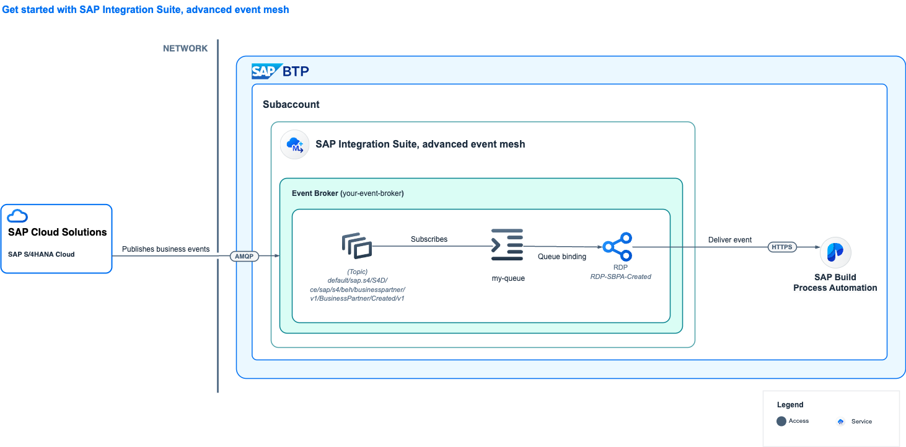

### Create a service key for the SAP Build Process Automation instance

SAP Integration Suite, advanced event mesh will be forwarding events to SAP Build Process Automation. In order to configure the secure connection between these services, we will need to create a service key for SAP Build Process Automation, which will be used by AEM to connect and deliver the event to SAP Build Process Automation service.

1. In the SAP BTP cockpit, go to **Instances and Subscriptions**.

    Under **Instances**, click the 3 dots next to the SAP Build Process Automation instance, e.g., **spa-service** in the screenshot below, and select  

    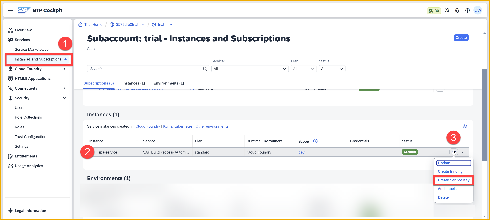

2. In the dialog, give the key a name, e.g., **spa-key**.

    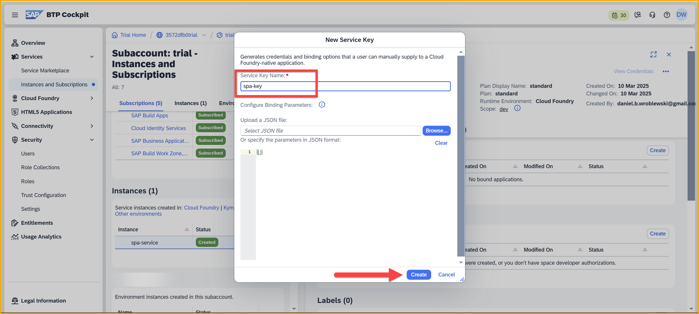

    Click **Create**

3. After the key is created (it will take about half a minute), click he 3 dots next to the key and download the key.

    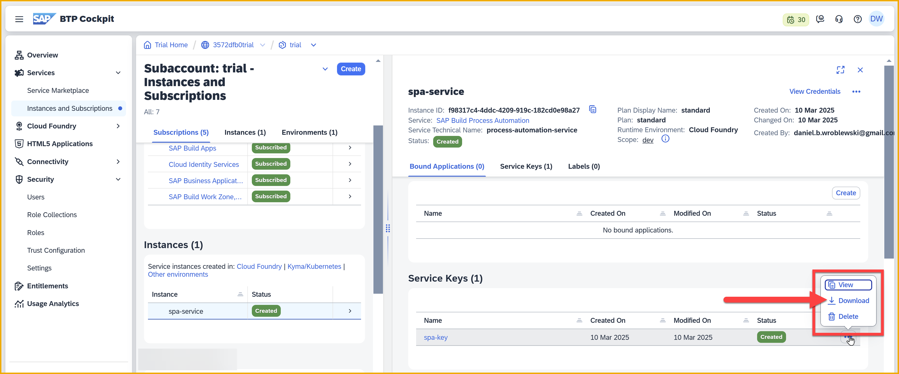

    Keep it in a safe place. You will need it later in the tutorial.

### REST Delivery Points (RDP)

A REST delivery point (RDP) is a provisioned object on an event broker service that facilitates message delivery to REST consumers. The RDP can be bound to message queues to deliver messages from those queues to REST consumers. The RDP maintains a list of REST consumers, which are identified by their remote connection information.

For this tutorial, we will use an event broker service in AEM and in it, we can create a new queue or reuse an existing queue. In the steps below we will be using a queue named `EDP_BP_Created_[SAPCommunityDisplayName]` but this can be something different on your end.

> To learn how to configure a queue in SAP Integration Suite, advanced event mesh, you can check out this tutorial 👉 [Queues and subscriptions in SAP Integration Suite, advanced event mesh](../pubsub-queues-subscriptions/pubsub-queues-subscriptions.md)

The queue will need to be subscribed to the business event that you are interested in sending to SAP Build Process Automation, e.g. the `default/sap.s4/S4D/ce/ce/sap/s4/beh/businesspartner/v1/BusinessPartner/Created/v1` topic which is where an Business Partner created event will be published.

> Note that in order for SAP Build Process Automation to be able to process the event, the event needs to follow the [CloudEvents specification](https://cloudevents.io).

### Create a REST Delivery Point

Now that we know what a REST Delivery Point is, we are ready to create a REST Delivery Point (RDP) to forward messages from the queue to a REST consumer.

1. Inside the event broker service where the queue exists, click **Open Broker Manager**.

2. Click **Clients** on the left-side menu.

    Click **REST**.

    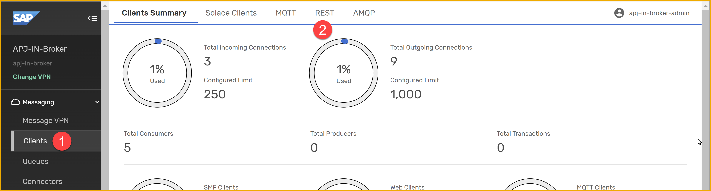

3. Click **+ REST Delivery Point**.

    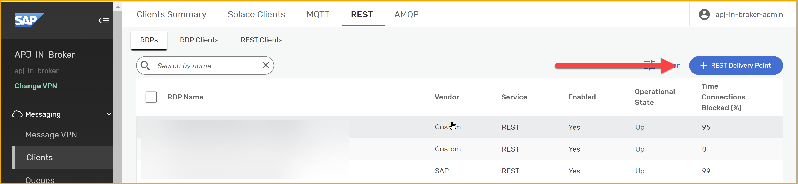

    Enter a name, e.g., `EDP-SBPA-BPCreated-[SAPCommunityDisplayName]`.

    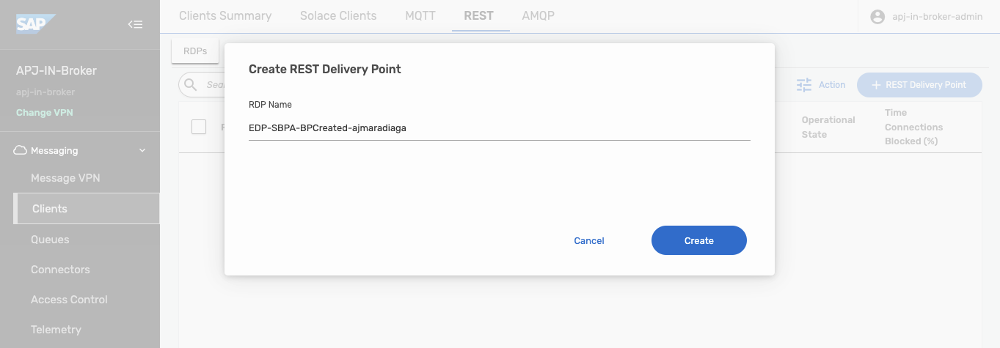

    Click **Create**.

    A simple configuration form will appear. No need to modify anything here – **Do not enable the RDP yet**, that is, leave the toggle button off.

    Click **Apply**.

    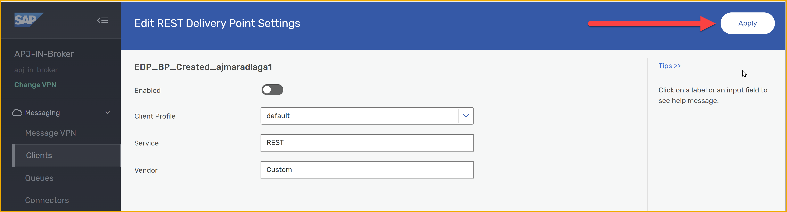

4. Once created, go to the RDP details page by clicking on the name of the RDP.

    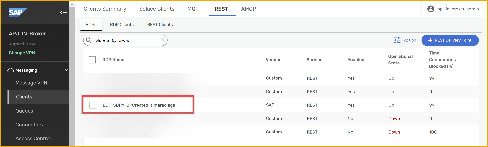

    You will see that there isn't much here yet, as we haven't configured the REST consumer details. We will do this now.

    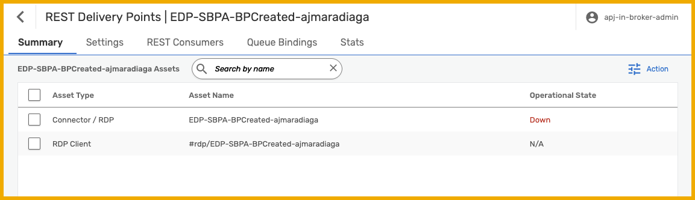

### Configure the REST consumer

Now that we've created a REST Delivery Point, we have to specify where we want events sent.

1. Navigate to the **REST Consumers** tab.

2. Click **+ REST Consumer**, and enter the name, e.g., `SBPA_[SAPCommunityDisplayName]`. 

    Click **Create**.

    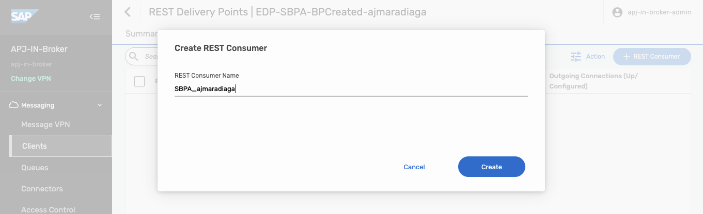

    A configuration form will be displayed.

3. Enter the details from the SAP Build Process Automation service key created in the previous step.

    >**IMPORTANT:** Do not enable the REST Consumer yet – leave the toggle button off.

    Enter the following:

    | Field                   | Value                                                                                                                                                              |
    | ----------------------- | ------------------------------------------------------------------------------------------------------------------------------------------------------------------ |
    | *Host*                  | Value from service key `.endpoints.api`, e.g.`spa-api-gateway-bpi-us-prod.cfapps.[region].hana.ondemand.com`                                                       |
    | *Port*                  | `443`                                                                                                                                                              |
    | *HTTP Method*           | `POST`                                                                                                                                                             |
    | *TLS Enabled*           | `Yes`                                                                                                                                                              |
    | *Authentication Scheme* | `OAuth 2.0 Client Credentials`                                                                                                                                     |
    | *Client ID*             | Value from service key `.uaa.clientid`, e.g. *sb-VQ18I1VS-3226-5LF1-JVWV-760D08FHP857-3ok534d4-8562-632j-436w-0j5b0n8r4d0l!b139588 \| eventing-xsuaa-broker!b####* |
    | *Client Secret*         | Value from service key `.uaa.clientsecret`                                                                                                                         |
    | *Token Endpoint URL*    | Concatenate the value from service key `.uaa.url`, e.g. *https://[host].authentication.[region].hana.ondemand.com*, and `/oauth/token`                             |
    | *Token Expiry Default*  | `3600`                                                                                                                                                             |

4. Click **Apply**.

    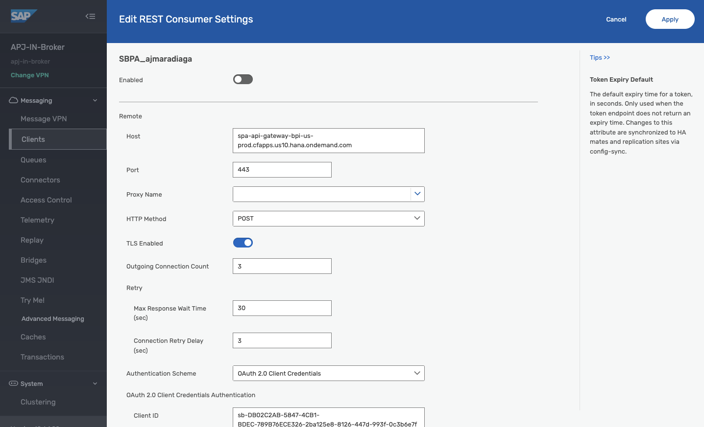

The newly created REST consumer will be listed in the REST Consumers tab. Now we need to configure the queue that we will bind to our RDP. Events in this queue will be forwarded.

### Configure Queue binding

Now that we have a REST consumer configured, we can proceed to bind a queue and configure the binding for our REST Delivery Point. All events received by the queue will be then forwarded to the REST consumer we configured, once enabled.

1. Navigate to the **Queue Bindings** tab. 

2. Click **+ Queue Binding**. 
    
    Select the queue you previously created, e.g., `EDP_BP_Created_[SAPCommunityDisplayName]`.

    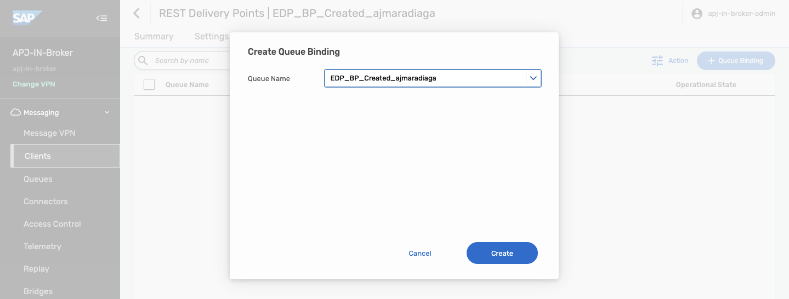

3. Click **Create**.

4. A simple configuration form will be displayed. 

    In the **Post Request Target** field, you need to enter the path where we can send events to SAP Build Process Automation (`/internal/be/v1/events`). Notice that you will need to include the `/` at the beginning of the value.

    Enter the following details:

    | Field                       | Value                    |
    | --------------------------- | ------------------------ |
    | *Post Request Target*       | `/internal/be/v1/events` |
    | *Request Target Evaluation* | None                     |
    | *Replace Target Authority*  | No                       |

    Click **Apply**.

    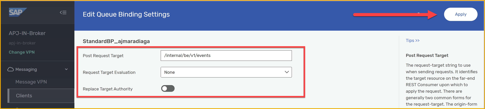

The newly created queue binding will be listed in the **Queue Bindings** tab. Now we need to configure a request header that is required by SAP Build Process Automation.

### Configure Request Headers

Now that we have a Queue binding configured, we need to set some request headers which are specific to SAP Build Process Automation.

1. In the **Queue Bindings** tab, select your queue binding.

    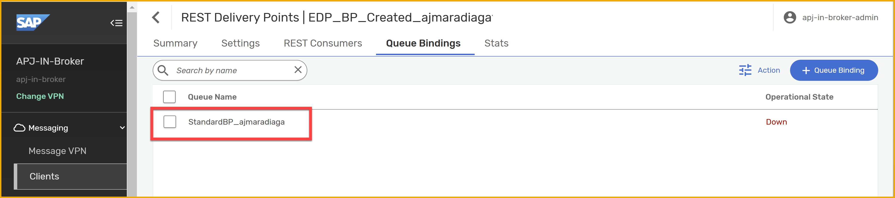

2. Navigate to the **Request Headers** tab.

    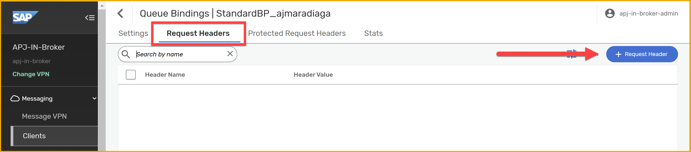

3. You will create 2 headers. 
    
    For each, you will click **+ Request Header**, enter the header name, then the header value, and then click **Apply**.

    Create the following headers:

    | Header Name              | Header Value                   |
    | ------------------------ | ------------------------------ |
    | `Content-Type`           | `application/cloudevents+json` |
    | `WebHook-Request-Origin` | `aem`                          |

    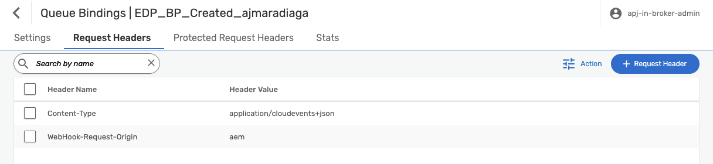

> In the request headers configured we specified the Content-Type header. We can see that its value is _application/cloudevents+json_. This is because SAP Build Process Automation expects events that follow the CloudEvents specification.

Now that we've created the request headers, we are ready to enable the REST consumer and the RDP.

### Enable the REST Consumer and RDP

We've configured the REST consumer and the queue binding, we can enable the REST consumer and the RDP.

First, let's see all the objects that we've configured.

1. Navigate back to the main page for your RDP.

    Select the **Summary** tab. Here you will see all the objects and their status. Notice that the only object in an operational state is the queue we created at the beginning of the exercise.

    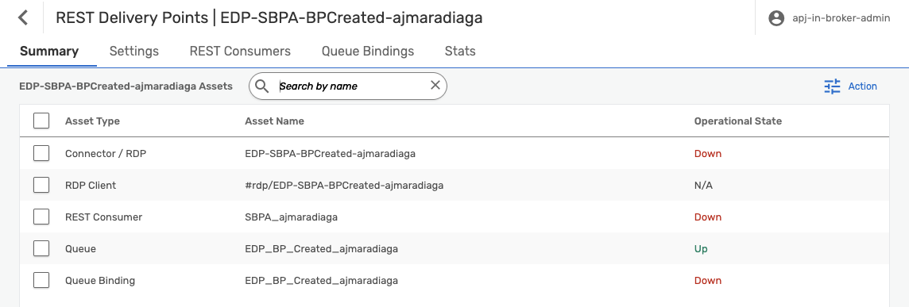

2. Navigate to the **REST Consumers** tab, and click the name of your REST consumer, e.g., `SBPA_[SAPCommunityDisplayName]`.

    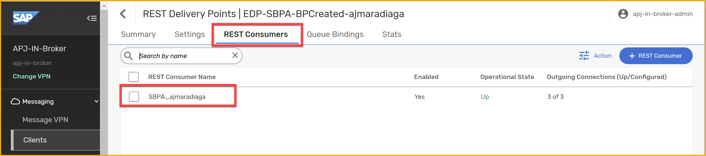

3. Click **Edit** on the top right.

    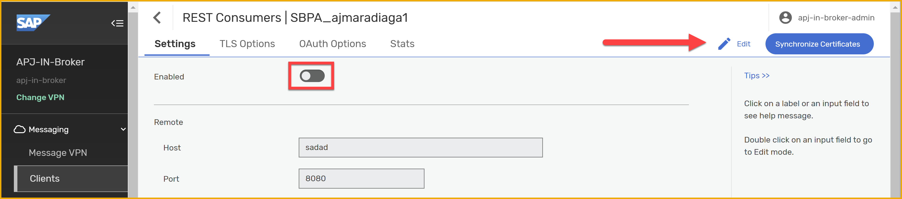

    Enable the REST consumer by toggling the **Enabled** setting.
    
    Click **Apply**.

    Now we are ready to enable our RDP.

4. Navigate back to the main page for your RDP.

    Select the **Summary** tab.
    
5. Click on the **Connector / RDP**, e.g., `EDP-SBPA-BPCreated-[SAPCommunityDisplayName]`.
    
    Click **Edit** on the top right, and enable the RDP by toggling the **Enabled** setting.
    
    Click the **Apply** button.

    Once we enable the RDP, if we navigate to the `Summary` tab, we should see that all the objects are in an operational state.

    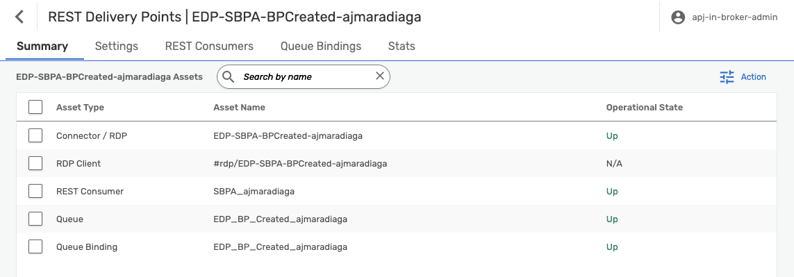

6. Now, go to the SAP S/4HANA Cloud system and create a Business Partner. 

    This will trigger a Business Partner event which you will receive in your queue.

    Check that the queue configured for the RDP is accumulating messages.

    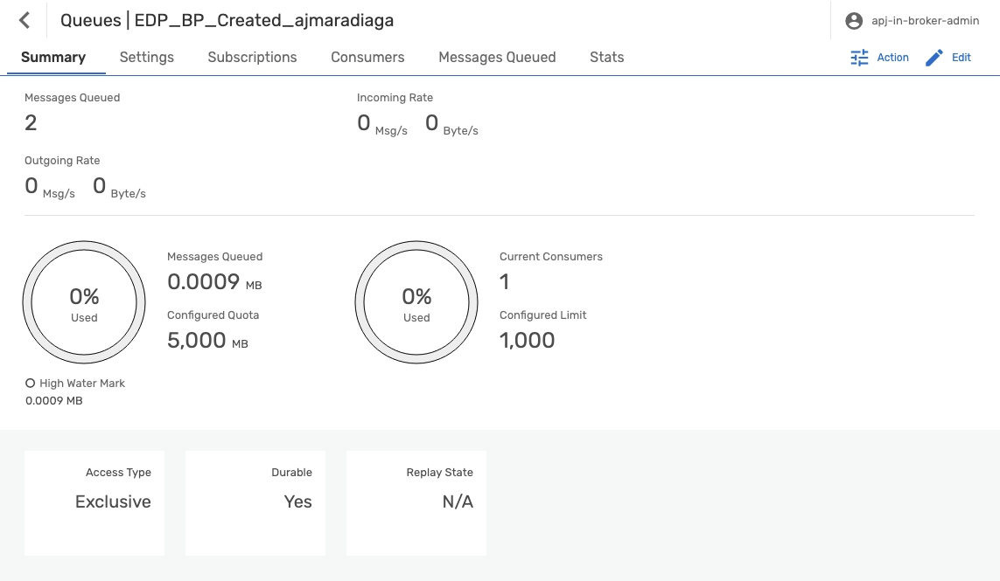

### Trigger processes in SAP Build Process Automation

Now that you've created events and sent them to your SAP Build Process Automation tenant, create a project that can be triggered by those events.

To achieve this, you can follow the steps in the [Capture Events in SAP Build Process Automation tutorial](../codejam-events-process-6/codejam-events-process-6.md).

### Summary

This tutorial completed all the configuration required for the REST Delivery Point.

1. Created a REST Delivery Point. 
2. Defined an RDP REST Consumer, where we configured the details of our SAP Build Process Automation tenant.
3. Bound a queue to our RDP.
4. Added request headers to the queue binding.
5.  Enabled it all.

### Further study

In this tutorial, we have learned how to create a REST Delivery Point (RDP) to forward messages from a queue to a REST consumer. We used OAuth 2.0 authentication to securely deliver events to SAP Build Process Automation. Now we know a mechanism to enable systems that expose REST endpoints to "react" to events produced by an event broker service.

* Managing REST Delivery Points - [link](https://docs.solace.com/Services/Managing-RDPs.htm)
* REST Consumer Authentication Schemes - [link](https://docs.solace.com/Services/Managing-RDPs.htm#configuring-REST-consumer-authentication-schemes)
* Integration with Advanced Mesh Service Plan for Service Cloud - [link](https://help.sap.com/docs/SAP_S4HANA_CLOUD/0f69f8fb28ac4bf48d2b57b9637e81fa/9b34c841dfba4f82af0825a2f3196ecf.html?locale=en-US)

>**Things to Ponder**
>
> 1. What if you would need to transform or enrich the message before sending it to the REST consumer? How would you do it?
> 2. Can you think of a system within your company that exposes REST endpoints and could benefit from being part of an event-driven architecture?
