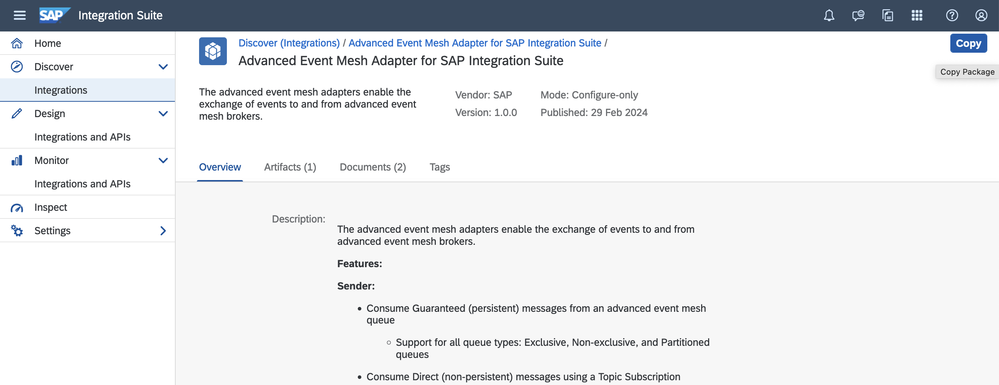

# Using Cloud Integration to consume and publish in SAP Integration Suite, advanced event mesh

<!-- description -->Learn how you can configure an integration flow in Cloud Integration to consume and publish events from/to SAP Integration Suite, advanced event mesh.

## Prerequisites
- You have access to an SAP Integration Suite, advanced event mesh tenant and an SAP Integration Suite tenant.

## You will learn
- How to configure the AEM sender adapter in Cloud Integration.
- How to configure the AEM receiver adapter in Cloud Integration.

## Intro

In this tutorial, you will consume the events from AEM using the Cloud Integration service. You will leverage the [AEM adapter](https://hub.sap.com/integrationadapter/AdvancedEventMesh) available and use it in an integration flow to consume events from a queue in AEM (the AEM adapter uses the Solace Messaging protocol). You will then enrich the message and publish it to a topic. 

By the end of this tutorial, you will achieve a communication scenario like the one below.

> The goal of this exercise is not to create an integration flow from scratch but to get familiar with the AEM integration adapter and understand the connectivity mechanism between AEM and Cloud Integration.

Before you get started, make a note of the connection details for the Solace Messaging adapter available in the event broker service, as you will be using these details in the integration flow configuration.

### Queue for Cloud Integration

👉 Access the event broker service that you want to connect to and create or clone a queue for the exclusive access of Cloud Integration. If cloning an existing queue, make sure to also clone the subscriptions, see screenshot below. In the tutorial, [Queues and subscriptions in SAP Integration Suite, advanced event mesh](../pubsub-queues-subscriptions/pubsub-queues-subscriptions.md), you can see how you can create a queue from scratch.

You will be connecting to the queue from Cloud Integration, to consume the events received by the queue.

### Set up components in Cloud Integration

Before you can receive message from the queue, you need to set up a few things in Cloud Integration:

1. Create a secure parameter for the Solace Messaging password.
2. Import the Advanced Event Mesh adapter from the SAP Business Accelerator Hub.
3. Import the integration flow available in the assets folder.

#### Create a secure parameter for the Solace Messaging password

👉 Go to your SAP Integration Suite instance and create a secure parameter in `Monitor` > `Integration and APIs` > `Manage Security` section > `Security Material`. Then from the `Create` menu select `Secure Parameter`. Provide the details below and deploy.

| Field            | Value                                                                                        |
| :---------------- | :-------------------------------------------------------------------------------------------- |
| Name             | SolaceMessaging_AEMBroker_Password                                                       |
| Description      | Password for Solace Messaging in my AEM broker                                             |
| Secure Parameter | *Password field in the Connect > Solace messaging section* |

Take note of the secure parameter name as you will be using it in the integration flow when configuring the flow before deployment.

#### Import the Advanced Event Mesh adapter

> Importing the Advanced Event Mesh adapter from the SAP Business Accelerator Hub to the tenant might not be always necessary, as the adapter might be already available in the tenant. For example, if you have already used the adapter in a different integration flow, then the adapter will be available in the tenant. Also, the first time you set up a Sender/Receiver to use the AdvancedEventMesh adapter, it will automatically get the adapter from the SAP Business Accelerator Hub and deploy it in the tenant. Not the case in this exercise as you are importing an existing integration flow and you aren't setting up the connections from scratch. The steps below are provided for the case when the adapter is not available in the tenant.

👉 Go to your SAP Integration Suite instance and navigate to `Discover` > `Integrations`, search for `Advanced Event Mesh` and select the Advanced Event Mesh adapter for SAP Integration Suite. 

👉 Once in the adapter details, click on the `Copy` button in the top right-hand corner. This action will copy the adapter to your SAP Integration Suite tenant.

Now the AEM adapter is in the tenant and you can see that there is a new integration package called `Advanced Event Mesh Adapter for SAP Integration Suite`, within its artifacts is the adapter itself. Let's deploy it.

👉 Click the `Actions` button for the integration adapter and select `Deploy`.

> You will be able to see the deployed content in `Monitor` > `Integrations and APIs` >  `Manage Integration Content` > `All`.

#### Import the integration package

Now you will go ahead and import the sample integration package available [here](./assets/aem-iflow-sample.zip).

> Ensure that you've downloaded the `aem-iflow-sample.zip` file from the assets folder in the GitHub repository. The integration package is available here: [https://github.com/sap-tutorials/eda/blob/main/tutorials/aem-integrate-cloud-integration-iflow/assets/aem-iflow-sample.zip](https://github.com/sap-tutorials/eda/blob/main/tutorials/aem-integrate-cloud-integration-iflow/assets/aem-iflow-sample.zip).

👉 Go to your SAP Integration Suite instance and navigate to `Design` > `Integrations and APIs` and click the **Import** button in the top right hand corner, select the `aem-iflow-sample.zip` file and click the Open button.

Once imported, you will see the `Consume_Publish_Events_AEM` integration flow, in the `Artifacts` tab, of the `AEM iFlow Sample` integration package. 

### Get familiar with the AEM adapter and the integration flow

As stated at the beginning, the integration flow is very simple, it consumes the events from the queue in AEM, enriches the message and publishes it to a topic.

> 🧭 Take some time to explore the integration flow itself...Some ideas: 
> - Check the tabs and configuration options available in the sender adapter (Connection, Processing).
> - Check the tabs and configuration options available in the sender adapter (Connection, Processing, Message properties).
> - What are you doing in the Groovy script that's enriching the message?
> - Which is the Transport Protocol used by the adapters?
> - Which is the Message Protocol used by the adapters?

Now that you are familiar with the `Consume_Publish_Events_AEM` integration flow, let's configure it.

### Configure the Integration Flow

👉 Click the `Actions` button for the integration flow and `Configure` its externalised parameters with the details below:

| Section | Field | Value | 
| :------- | :----- | :----- |
| Sender | Host | *Secured SMF Host field in the Connect > Solace messaging section* |
| Sender | Message VPN | *Message VPN field in the Connect > Solace messaging section* |
| Sender | Username | *Username field in the Connect > Solace messaging section* |
| Sender | Password Secure Alias | `SolaceMessaging_AEMBroker_Password` |
| Sender | Queue Name | `[your-queue]` |
| Receiver | Destination Name | `[your/topic/abc]` |

### Deploy the Integration Flow

👉 Once you've configured the externalised parameters, click the `Deploy` button to deploy the integration flow.

If you are using SAP Integration Suite in the BTP trial environment, it might take a few minutes to deploy the integration flow. Also, you might get an error message stating that it has failed to deploy. You can safely ignore this error message if it is the first time deploying as it just takes some time the first time you deploy an integration flow. 

> You can monitor the deployment status in `Monitor` > `Integrations and APIs` >  `Manage Integration Content` > `All` tile or in the integration flow itself under the `Deployment status` tab.

### Monitor integration flow and produced messages

Now our integration flow is ready to process the purchased tickets events from AEM. The service which is simulating the ticket purchased events is continuously sending events to the topic configured in the receiver adapter, for example `your/topic/abc` and in a matter of seconds you will see our integration flow processing the events.

👉 Go to the `Monitor` > `Integrations and APIs` > `Monitor Message Process` > `All Artifacts` tile and see the messages being processed.

Also, you can check the produced messages in the event broker service by subscribing to the topic where the integration flow is publishing the messages.

👉 Go to the `Try Me!` UI in the event broker service you are connecting to and subscribe to the topic defined in the AEM receiver adapter. Same as before, you will receive "enriched" messages published on the topic in a matter of seconds.

### Further Study

You've covered a lot in this tutorial. You started by creating a separate queue for Cloud Integration and then set up the components in Cloud Integration. You created a secure parameter for the Solace Messaging password, imported the Advanced Event Mesh adapter from the SAP Business Accelerator Hub and imported the integration flow available in the assets folder. Finally, configured the integration flow, deployed it and monitored the messages flowing in Cloud Integration. Hopefully, this gives you a hint on what is possible when connecting Cloud Integration with SAP Integration Suite, advanced event mesh using the AEM adapter.

- Advanced Event Mesh adapter in the SAP Business Accelerator Hub - [link](https://hub.sap.com/integrationadapter/AdvancedEventMesh).
- Advanced Event Mesh adapter - Help documentation - [link](https://help.sap.com/docs/integration-suite/sap-integration-suite/advanced-event-mesh-adapter).
- Solace Message Format (SMF) - [link](https://docs.solace.com/API/Component-Maps.htm).
