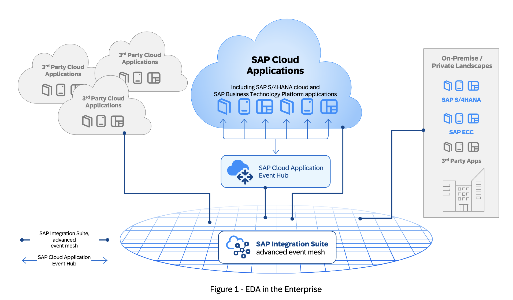
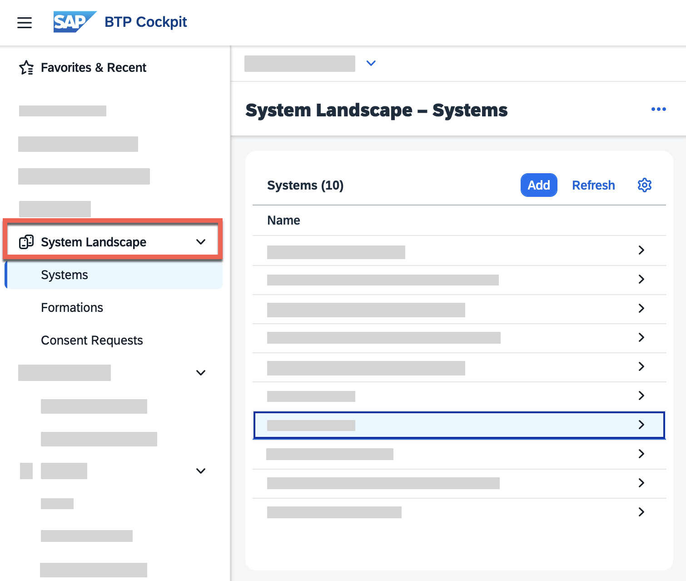
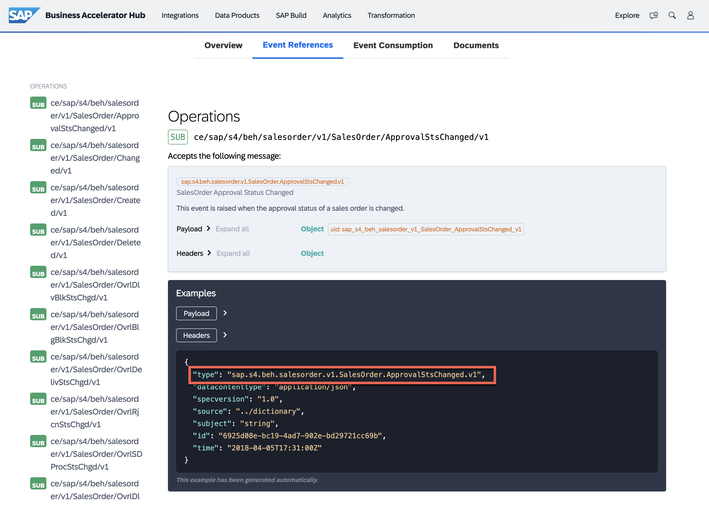
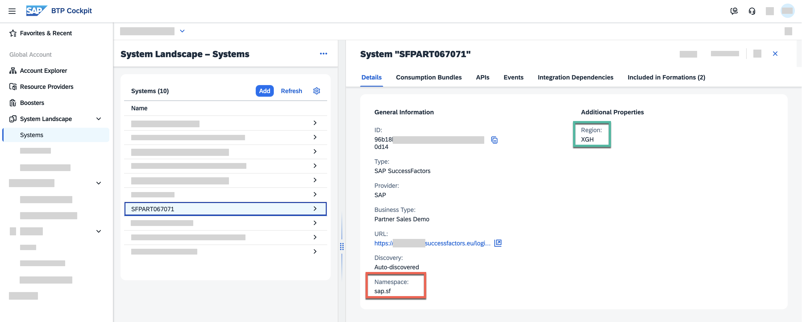
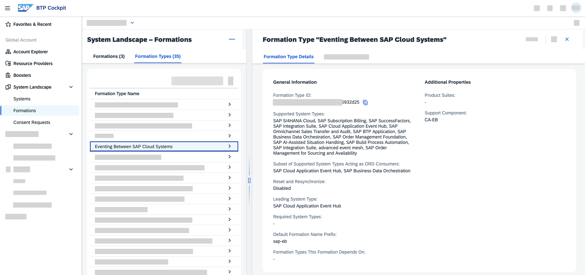
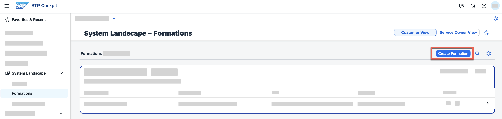
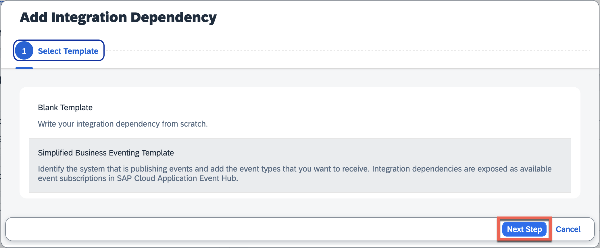
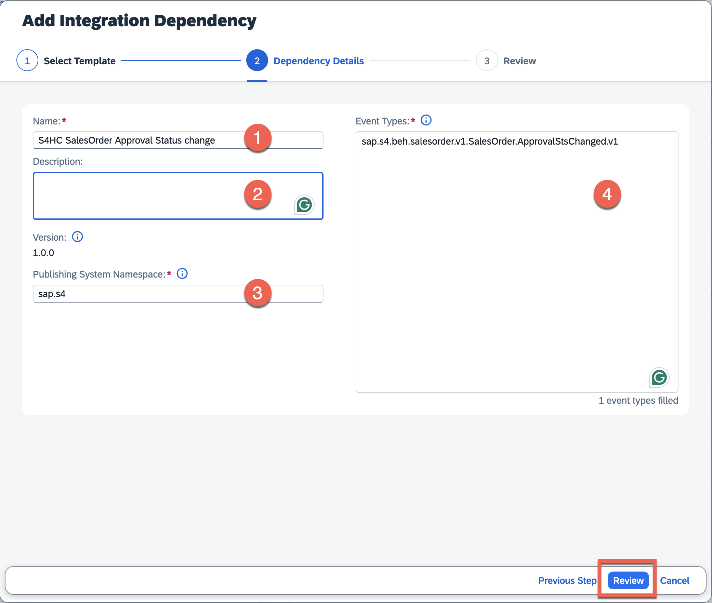

# Basic concepts of SAP Cloud Application Event Hub

<!-- description -->Learn some basic concepts of SAP Cloud Application Event Hub before getting started with the exchange of events between SAP cloud applications.

## You will learn

- Get familiar with the BTP Global account System Landscape and formations.
- How we define an integration dependency between SAP cloud applications
- How we enable eventing between SAP cloud applications using subscriptions in Event Hub

### What is SAP Cloud Application Event Hub?

SAP Cloud Application Event Hub is a service available in SAP BTP which allows us to easily distribute business events across SAP cloud applications. If you have more than one SAP cloud application configured in the SAP BTP global account System Landscape, data in one cloud application could be relevant for the other cloud application. SAP Cloud Application Event Hub provides a secure means of distributing the event data between the SAP cloud applications.



### SAP BTP Global Account - System Landscape

All the configurations related to eventing between SAP cloud applications revolve around the BTP global account System Landscape. For example:

- We need to register the SAP cloud applications in the SAP BTP global account System Landscape.
- We need to create a formation of type Eventing Between SAP Cloud Systems in the System Landscape
- We need to define integration dependencies between the SAP cloud applications.

To access the System Landscape, navigate to your SAP BTP global account and select **System Landscape** from the left-hand side menu.



#### What is an SAP cloud application?

An SAP cloud application, in broad terms, is any SAP application that is hosted in the cloud by SAP. In the context of SAP Cloud Application Event Hub, a system is any SAP cloud application that is registered in the BTP global account System Landscape and that can produce or consume events via Event Hub. Examples of SAP cloud applications include:

- SAP S/4HANA Cloud (Public and Private editions)
- SAP Subscription Billing
- SAP SuccessFactors
- SAP Integration Suite (Cloud Integration)
- SAP Integration Suite, advanced event mesh
- SAP BTP application, e..g CAP applications deployed in SAP BTP
- SAP Build Process Automation
- and more...


#### Events produced by an SAP cloud application

We can learn about the different event types an SAP cloud application produces by visiting [SAP Business Accelerator Hub - Events](https://hub.sap.com/content-type/Events/events/events). For example, [SAP S/4HANA Cloud Public Edition](https://api.sap.com/products/SAPS4HANACloud/events/events) produces events for various business objects, such as [`Business Partner`](https://hub.sap.com/event/CE_BUSINESSPARTNEREVENTS/resource), [Sales Orders](https://hub.sap.com/event/CE_SALESORDEREVENTS/resource), etc.

If we visit the Sales Order event resource, we can see that there are many different event types related to Sales Orders. In the example below, we can see what the **Sales Order Approval Status Changed** event type looks like. In the Headers section, there is a field called `type` which indicates the event type that we will use when defining the integration dependency for a system.



### CloudEvents

SAP Cloud Application Event Hub uses the [CloudEvents](https://cloudevents.io/) specification for the events exchanged between SAP cloud applications. Meaning, all events exchanged via Event Hub need to conform to the CloudEvents specification. This is a standard widely adopted within SAP and all SAP cloud applications produce events following this specification.

CloudEvents is a specification for describing event data in a common way. Its goal is to simplify event declaration and delivery across services, platforms and beyond! The specification is now under the [Cloud Native Computing Foundation](https://cncf.io/).

Below is an example of what a Choose message will look like:

```JSON
{
  "specversion" : "1.0",
  "type" : "com.github.pull_request.opened",
  "source" : "https://github.com/cloudevents/spec/pull",
  "subject" : "123",
  "id" : "A234-1234-1234",
  "time" : "2018-04-05T17:31:00Z",
  "comexampleextension1" : "value",
  "comexampleothervalue" : 5,
  "datacontenttype" : "text/xml",
  "data" : "<much wow=\"xml\"/>"
}
```

You'll notice that the example above is composed of many attributes. These attributes describe the event and are independent of the event data. Meaning that you can somehow process/inspect the event without needing to process its data. Now, let's dive a bit into the message itself.

>For more information on how SAP has adopted CloudEvents, check out this blog post: <https://community.sap.com/t5/application-development-blog-posts/cloudevents-at-sap/ba-p/13620137>.

#### CloudEvents message format

A Choose message is mainly composed of context attributes and data. As you briefly touched on previously, the payload in the data field will depend if it is a notification event or a data event.

#### Context attributes

Several attributes can be included within the message, these attributes are known as [context attributes](https://github.com/cloudevents/spec/blob/v1.0.2/cloudevents/spec.md#context-attributes) and the idea is that these context attributes can be used to describe the event. You can think of these context attributes as the header information of our event.

Let's explore some of the attributes available.

| Name | Required | Description | Example |
| ---- | ----- | ---- | --- |
| id | ✅ | Identifies the event. Producers MUST ensure that source + id is unique for each distinct event. | QgEK7wzuHtqdhJwqCS+VOA== |
| source | ✅ | Identifies the context in which an event happened. | <https://github.com/cloudevents> |
| specversion | ✅ | The version of the CloudEvents specification which the event uses. | `1.0` |
| type | ✅ | Describes the type of the event | `sap.s4.beh.businesspartner.v1.BusinessPartner.Created.v1` |
| datacontenttype | | Content type of the value in data. | `application/json` |

#### Extension context attributes

A Choose message may also include additional context attributes, which are not defined as part of the specification. These additional attributes are known as "extension context attributes" and can be used by the producer systems to include additional metadata to an event, similar to how you can use HTTP custom headers.

👉 Check out the events available for the [SAP Digital Vehicle Hub](https://hub.sap.com/event/SAPDigitalVehicleHubBusinessEvents_SAPDigitalVehicleHubBusinessEvents/resource) in the SAP Business Accelerator Hub.

For example, in the [SAP Digital Vehicle Hub Business Events package](https://hub.sap.com/event/SAPDigitalVehicleHubBusinessEvents_SAPDigitalVehicleHubBusinessEvents), you can see that the event is raised when a vehicle changes – `sap.dmo.dvh.Vehicle.Changed.v1` – and it contains the extension context attribute `sappassport`, which is an SAP-specific tracing identifier.

```JSON
{
  "specversion": "1.0",
  "type": "sap.dmo.dvh.Vehicle.Changed.v1",
  "source": "/eu10/sap.dmo.dvh",
  "subject": "808E6E30B65149978A443429B29FB300",
  "id": "a823e884-5edc-4194-a81a-f3a3632417ee",
  "time": "2018-04-08T08:31:00",
  "datacontenttype": "application/json",
  "sappassport": "string",
  ....
}
```

#### Data field

A Choose message may include a payload but this is not required. If included, it will be in the format specified in the `datacontenttype` context attribute. Although it is not required, you will generally have a payload in messages. Below you can see an example of an event message that contains a payload.

```JSON
{
  "specversion": "1.0",
  "type": "sap.dmo.dvh.Vehicle.Changed.v1",
  "source": "/eu10/sap.dmo.dvh",
  "subject": "808E6E30B65149978A443429B29FB300",
  "id": "a823e884-5edc-4194-a81a-f3a3632417ee",
  "time": "2018-04-08T08:31:00",
  "datacontenttype": "application/json",
  "sappassport": "string",
  "data": { 
    "BusinessPartner": "10003245"
  }
}
```

> 🧭 Take some time to explore what's documented on the [Business Partner events - Overview page](https://hub.sap.com/event/CE_BUSINESSPARTNEREVENTS/overview). We will be able to find lots of valuable information here, for example, [event reference](https://hub.sap.com/event/CE_BUSINESSPARTNEREVENTS/resource), event specifications (in JSON and YAML format), and a link to the [documentation](https://help.sap.com/docs/SAP_S4HANA_CLOUD/3c916ef10fc240c9afc594b346ffaf77/a75345282ddd4054a1e5ce7687e4b088.html?locale=en-US&state=PRODUCTION&version=2402.500).

Now, you might have noticed that the event samples shared in this tutorial are in JSON format and follow a specific format. They all contain a similar structure, some header information (metadata) describing the message (like `id`, `type`, `specversion`, `source`, `type`, `datacontenttype`) and a `data` node, which includes the actual payload. This is because SAP has adopted the CloudEvents specification as the common format for its systems/applications to publish events.

### Systems

In the context of SAP Cloud Application Event Hub, a system is any SAP cloud application that is registered in the BTP global account System Landscape and that can produce or consume events via Event Hub. Examples of SAP cloud applications include SAP S/4HANA Cloud, SAP SuccessFactors, SAP Commerce Cloud, and others. Each system has a unique system ID and this information is used to identify the system and route the events to the appropriate consumer.

For example, in the screenshot below, we can see the details for an SAP SuccessFactors system registered in the System Landscape.



Three key aspects to highlight here are the `ID`, `Namespace` and the `Region`. The `Namespace` is used when defining the integration dependency for a system, as it helps identify the events produced by the system. The `Region` is a value that we will see in a event header sent by the SuccessFactors system. See how these three values concatenated form the `source` of the event header in the payload example below:

```JSON
{
  "specversion": "1.0",
  "id": "8bbb2074-b1e6-4236-8791-cab1dcb3ac8f",
  "source": "/XGH/sap.sf/96b18b1d_2a98_43c8_abb2_8fd211870d14",
  "type": "sap.sf.onboarding.journey.reviewNewHireData.created.v1",
  "datacontenttype": "application/json",
  "time": "2025-11-04T21:50:57.878197065Z",
  "data": {
    "onboardingProcessId": "221B90D45BB84F7CBB3E3C800E925B22",
    "assignmentIdExt": "103341",
    "extensionPointEnabled": false,
    "personIdExternal": "103341",
    "targetDate": "2025-11-04",
    "onboardingInternalHire": false,
    "source": "UserTask",
    "onb2StableId": "221B90D45BB84F7CBB3E3C800E925B22",
    "userId": "103341"
  }
}
```

### Formations

Before we can enable the exchange of events between SAP cloud applications, we need to create a formation in the BTP global account. A formation is a logical grouping of systems in the System Landscape. In this case, we are interested in the formation type called `Eventing Between SAP Cloud Systems`. This formation type allows SAP Cloud Application Event Hub to know which systems are allowed to exchange events.

> Note: Not all systems registered in the System Landscape can produce or consume events via SAP Cloud Application Event Hub. We can see the applications supported in the [SAP Help documentation](https://help.sap.com/docs/sap-cloud-application-event-hub/sap-cloud-application-event-hub-service-guide/integration-use-cases) and also in the systems listed in the Formation Type.
>
> 

In order to enable eventing between SAP cloud systems, we need to create an `Eventing Between SAP Cloud Systems` formation. A formation of this type needs to include an instance of SAP Cloud Application Event Hub and then we can add systems as needed.

1. Navigate to the SAP BTP cockpit global account, and select **Formations** under the **System Landscape** section. Then, click on the **Create Formation** button.
  
2. Enter a name and select the formation type **Eventing Between SAP Cloud Systems**. Then, click on the **Next Steps** button.
  
3. Now, select the instance of SAP Cloud Application Event Hub we created earlier. Then, click on the **Next Steps** button.
  
4. Finally, review the information and click on the **Create** button.

A new formation will now be listed in the Formations section.


### Integration Dependencies

By defining an integration dependency for a system in a formation, we are specifying which system will be producing the event(s) and that the system that we are configuring the dependency for is interested in consuming the same. The integration dependency is defined in the context of a formation, so both systems need to be part of the same formation. SAP Cloud Application Event Hub will use this information to know which events from a producing system need to be delivered to which consuming system.

To define an integration dependency for a system, we need to select the system and then choose the **Add** button in the **Integration Dependencies** section.


In the popup, we will select the **Simplified Business Eventing Template**, then choose the **Next Step** button.


Now, as we define the integration dependency, we specify the following information:

1. `Name`: Enter a meaningful name for the integration dependency.
2. `Description`: A description of the integration dependency.
3. `Publishing System Namespace`: The namespace of the system that will be producing the events. We can find the namespace of a system by navigating to the System Landscape, selecting the system, and then going to the Details tab.
4. `Event Types`: The types of events that the consuming system is interested in.



Once we've defined all the event types that the consuming system is interested in, we can choose the **Review** button and then choose **Add** to save the integration dependency.

The new integration dependency will now be listed as an available subscription in the SAP Cloud Application Event Hub UI. We can then enable it to start the exchange of events between the systems.

### Event Subscriptions in Event Hub

Once an integration dependency is defined for a system in a formation, this dependency will be listed as a subscription in SAP Cloud Application Event Hub. As an administrator of Event Hub, we can then enable or disable the event subscription to start or stop the exchange of events between the systems defined in the integration dependency.

In the screenshot below, we can see how a subscription is listed in the SAP Cloud Application Event Hub UI and how we can enable or disable it by toggling the Enable button.


### What about topics and queues?

For those familiar with event-driven architectures, you may have heard about topics and queues. In SAP Cloud Application Event Hub, these concepts are abstracted away from the user. We don't need to define topics or queues to exchange events between SAP cloud applications. Instead, we define integration dependencies between systems in a formation, and once we enable the subscriptions, Event Hub takes care of the message delivery.

### Further study

In this tutorial, we got familiar with the basic concepts required to understand the different components involved when using SAP Cloud Application Event Hub to exchange events between SAP cloud applications. Also, we explored the CloudEvents specification adopted by SAP for event messages.

To expand your learning, you might want to check out the links below and think about the open questions included in this section.

- SAP Cloud Application Event Hub - Concepts: [link](https://help.sap.com/docs/sap-cloud-application-event-hub/sap-cloud-application-event-hub-service-guide/concepts)
- SAP Applications Using SAP Cloud Application Event Hub - [link](https://help.sap.com/docs/sap-cloud-application-event-hub/sap-cloud-application-event-hub-service-guide/integration-use-cases)

>**Things to Ponder**
>
> 1. Which SAP cloud applications are supported as event publishers?
> 1. Which other formation types are available in the SAP BTP global account System Landscape?
