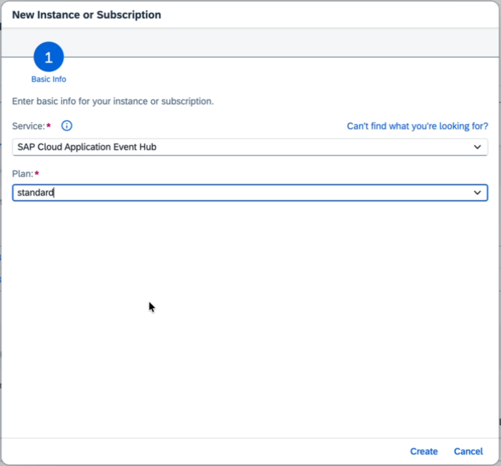
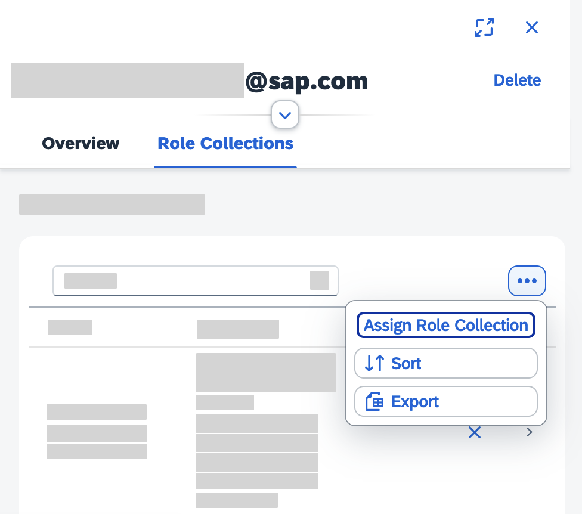
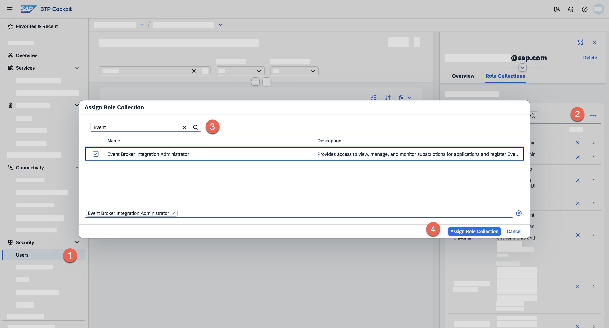
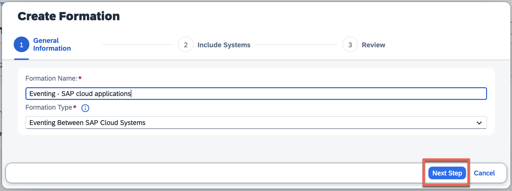
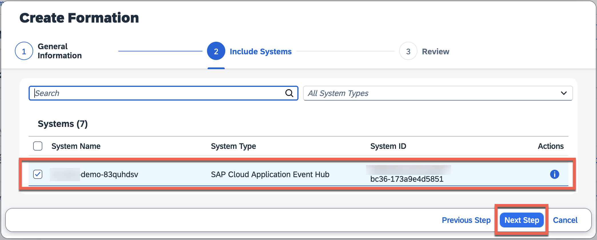
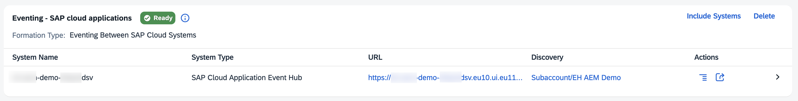
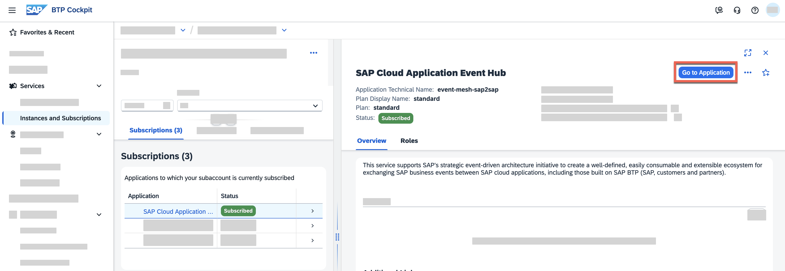
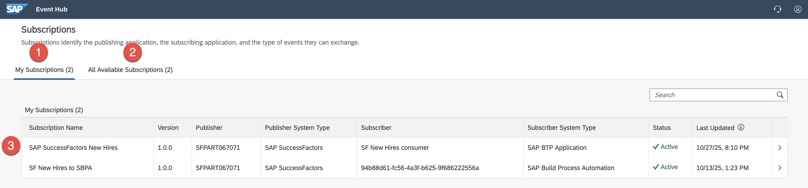
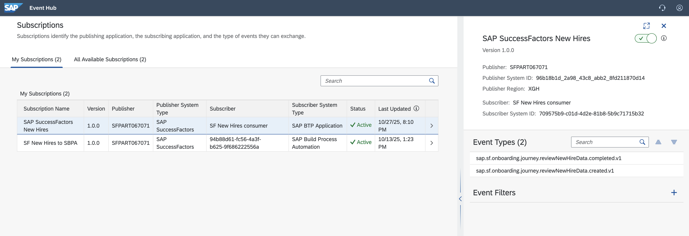

# Set up SAP Cloud Application Event Hub

<!-- description -->Learn to create an instance of SAP Cloud Application Event Hub (AEM), and get familiar with some of key parts of the product.

## Prerequisites

- If you are completing the Get started with SAP Cloud Application Event Hub mission, you should have access to an SAP BTP enterprise account.
- SAP Cloud Application Event Hub requires an Identity Authentication tenant to be configured in the subaccount. If you don't have one, please refer to [Tenant Model and Licensing](https://help.sap.com/docs/IDENTITY_AUTHENTICATION/6d6d63354d1242d185ab4830fc04feb1/93160ebd2dcb40e98aadcbb9a970f2b9.html?version=Cloud) or [SAP Business Technology Platform Bundle](https://help.sap.com/docs/IDENTITY_PROVISIONING/f48e822d6d484fa5ade7dda78b64d9f5/eb7ce66c895f4301b95b5c2f285d6667.html?version=Cloud). Once you have the tenant, you need to establish a trust configuration in the subaccount with the IAS tenant. More details included here: [Establish Trust and Federation Between UAA and Identity Authentication](https://help.sap.com/docs/BTP/65de2977205c403bbc107264b8eccf4b/161f8f0cfac64c4fa2d973bc5f08a894.html?locale=en-US&version=Cloud).

## You will learn

- How to create an instance of SAP Cloud Application Event Hub
- How to access the SAP Cloud Application Event Hub
- How to get around the UI

## Intro

In this tutorial, we will setup SAP Cloud Application Event Hub, and access its UI.

### Create and access an instance of SAP Cloud Application Event Hub

1. Log in to your SAP BTP account and navigate to **Services** > **Instances and Subscription**. Choose the **Create** button.

    

2. In the popup, select the service `SAP Cloud Application Event Hub` and select the plan `standard`. 

    

3. Once the instance is created, it will be listed in our subscriptions.

    

### Assign the required role to access UI

1. Navigate to the **Security** > **Users** and select the user you want to assign the role to.
2. Go to **Users** and select the user you want to assign roles to. Choose the **...** button and then choose **Assign Role Collection**.
    
3. In the **Assign Role Collection** popup, assign the following role:
      - **Event Broker Integration Administrator**
    
4. Choose **Assign Role Collection** button.

Now the user has the required role to access the SAP Cloud Application Event Hub UI.

### Create an Eventing Between SAP Cloud Systems formation

In order to enable eventing between SAP cloud systems, we need to create an `Eventing Between SAP Cloud Systems` formation. At the moment we will not enable the exchange of events but just create the formation with an instance of SAP Cloud Application Event Hub so that it is ready and then we can start adding systems later.

1. Navigate to the Global account, and select **Formations** under the **System Landscape** section. Then, click on the **Create** Formation** button.
   
2. Enter a name and select the formation type **Eventing Between SAP Cloud Systems**. Then, click on the **Next Steps** button.
    
3. Now, select the instance of SAP Cloud Application Event Hub you created earlier. Then, click on the **Next Steps** button.
    
4. Finally, review the information and click on the **Create** button.

A new formation will now be listed in the Formations section.

### Access SAP Cloud Application Event Hub UI

Now we'll access the SAP Cloud Application Event Hub UI and get familiar with the different sections available.

1. Navigate to the **Services** > **Instances and Subscription**.
2. Select the instance of **SAP Cloud Application Event Hub** you created earlier.
3. Click on the **Go to Application** button.

### Explore SAP Cloud Application Event Hub

The first time you access the SAP Cloud Application Event Hub UI, you will have no subscriptions. In the screenshots below, we will show you what a fully configured SAP Cloud Application Event Hub instance looks like.

1. **My Subscriptions**: All **active** subscriptions will be listed here.
2. **All available subscriptions**: Here you can see all the subscriptions available in the instance. In essence, any integration dependency that has been defined for all systems in the system landscape will be listed here.
3. For each subscription, we will see the name of the subscription, the system publishing the events, the system subscribed to the events and the status of the subscription. When a subscription is active, events will be flowing from the publishing system to the subscribing system.

In the [Event Hub - basic concepts tutorial](eh-basic-concepts), we can get familiar with the basic concepts required to start using SAP Cloud Application Event Hub.

### Further study

In this tutorial, we created an instance of SAP Cloud Application Event Hub  and got familiar with its UI.

To expand your learning, you might want to check out the links below and think about the open questions included in this section.

- SAP Applications Using SAP Cloud Application Event Hub - [link](https://help.sap.com/docs/sap-cloud-application-event-hub/sap-cloud-application-event-hub-service-guide/integration-use-cases)
- Filtering SAP Event Subscriptions - [link](https://help.sap.com/docs/sap-cloud-application-event-hub/sap-cloud-application-event-hub-service-guide/filtering-sap-event-subscriptions)

>**Things to Ponder**
>
> 1. If I need to disable a subscription temporarily, where would I do that in the UI?
> 2. Can I apply filters to the events being sent to a subscribing system?
> 3. Which SAP cloud applications are supported as event publishers?
