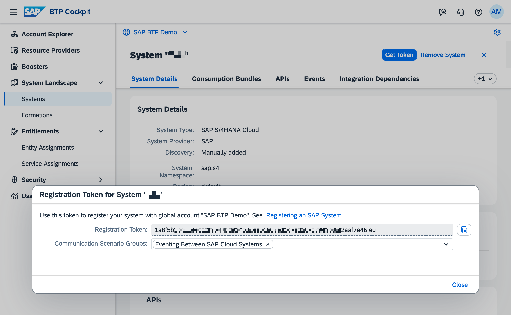
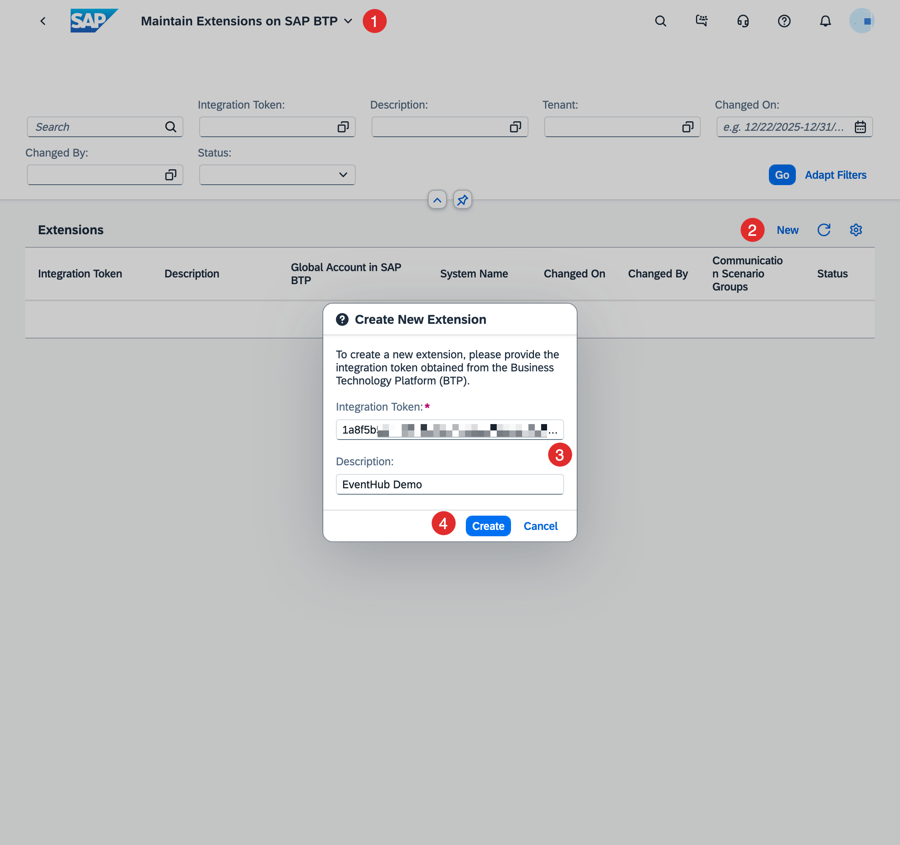
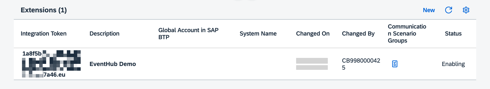
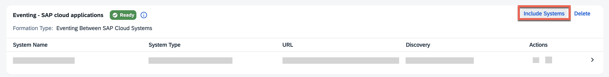
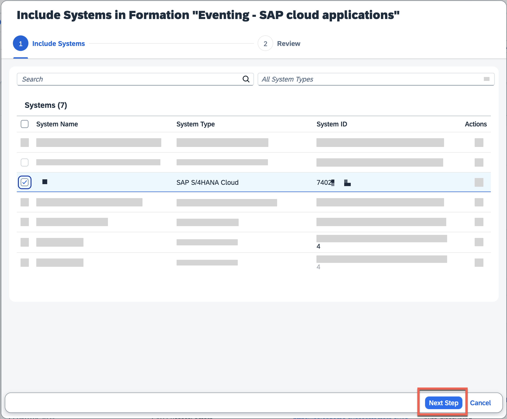
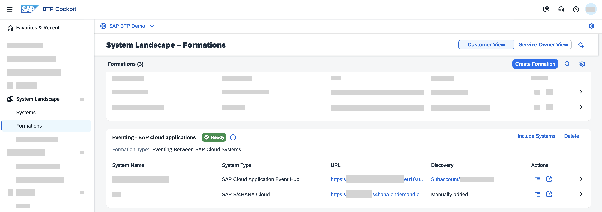
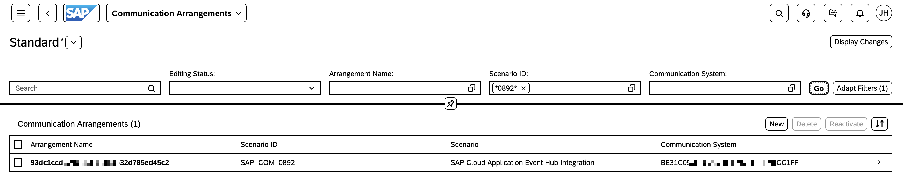
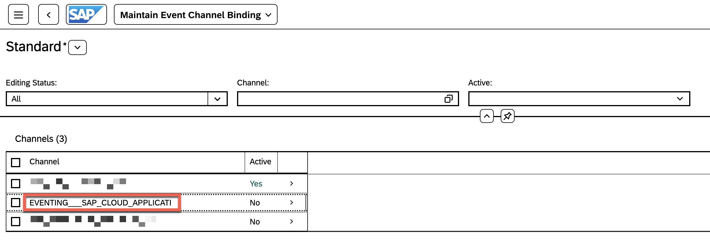

# Set up SAP S/4HANA Cloud Public edition connectivity with SAP Cloud Application Event Hub

<!-- description -->Learn how we can configure the connectivity between SAP S/4HANA Cloud Public edition and SAP Cloud Application Event Hub

## Prerequisites

- You have access to an SAP S/4HANA Cloud Public edition system and an instance of SAP Cloud Application Event Hub in your SAP BTP account.
- You've completed the previous tutorial: [Set up SAP Cloud Application Event Hub](../eh-setup-event-hub/eh-setup-event-hub.md).

## You will learn

- How to configure the connectivity between SAP S/4HANA Cloud Public edition and SAP Cloud Application Event Hub

## Intro

Now that we are familiar with the basic concepts of SAP Cloud Application Event Hub, we can proceed to configure the connectivity between SAP S/4HANA Cloud Public edition and SAP Cloud Application Event Hub. For this, we will be interacting with the SAP BTP cockpit and the SAP S/4HANA Cloud system. In the SAP BTP Cockpit we will add the system and get a token that we will require to link our SAP BTP account with the SAP S/4HANA Cloud tenant. Once we've achieve this, in SAP S/4HANA Cloud we will configure a communication arrangements which will set up the communication channel used to exchange events with SAP Cloud Application Event Hub.

### Add the SAP S/4HANA Cloud Public edition system in the SAP BTP system landscape

Depending on how your SAP BTP global account is setup, an SAP S/4HANA Cloud Public edition system may already be registered in your SAP BTP global account. Follow the steps below in case your SAP S/4HANA Cloud Public edition system is not registed.

1. Go to the SAP BTP cockpit and navigate to the **System Landscape** section. Here you will find all systems registered in your system landscape. Given that we've already created an instance of SAP Cloud Application Event Hub, you will see it listed here.

2. Choose the **Add System** button. Set the **System Name** and select `SAP S/4HANA Cloud` as the **System Type**.

    

3. In the dialog, select the **Communication Scenario Groups** `Eventing Between SAP Cloud Systems` and copy the value in the **Registration Token**. This token will be used in the next step when we add our SAP BTP account in SAP S/4HANA Cloud.

    

### Add the SAP BTP account details in SAP S/4HANA Cloud

1. In SAP S/4HANA Cloud, go to the **Maintain Extensions on SAP BTP** application.

2. Choose the **New** button. Enter the token copied from the previous step in the **Integration Token** field and set a meaningful description that can identify the SAP BTP global account. Once completed, choose the **Create** button.

    

3. Approve the extension creation by clicking the **Yes** button.

    

Once we've approved the extension the extension status will change to enabling and after a few seconds it will be enabled. Also, in the SAP BTP system landscape, you'll noticed that the SAP S/4HANA Cloud will now have a status of `Registered`.

### Enable event exchange between SAP S/4HANA Cloud and SAP Cloud Application Event Hub

Now that we have the SAP S/4HANA Cloud Public edition system registered in our SAP BTP global account, we can proceed to include it in a formation. The formation will need to be of type `Eventing between SAP cloud systems` to enable the event exchange.

1. In the SAP BTP cockpit, navigate to the **Formations** section, choose the **Include Systems** button in the formation. 

    

2. In the pop-up, select the SAP S/4HANA Cloud Public edition system you just registered. Then, choose the **Next Steps** button.

    

Once the formation finishes synchronizing, the SAP S/4HANA Cloud Public edition system will be part of the formation. SAP Cloud Application Event Hub will take of the necessary communication between SAP S/4HANA Cloud and itself. It will generate a communication system and communication arrangement in SAP S/4HANA Cloud.

### (Optional) Check the components created in SAP S/4HANA Cloud Public edition

We can optionally check the components created in SAP S/4HANA Cloud. For this, we will leverage the functionality available in the **Enterprise Event Enablement - Channel Binding** app.

1. In SAP S/4HANA Cloud, go to the **Communication Arrangements** app and filter by the .

    

2. Alternative, we can go to the **Enterprise Event Enablement - Channel Binding** app and a new channel will be listed representing the connection to SAP Cloud Application Event Hub. The channel will have a name similar to the name set for the formation in the SAP BTP cockpit.

    

### Further study

You can check out the following resources to learn more about the SAP S/4HANA Cloud and SAP Cloud Application Event Hub integration:

- Checking Event Publishing and Event Consumption Scenarios: [link](https://help.sap.com/docs/SAP_S4HANA_CLOUD/0f69f8fb28ac4bf48d2b57b9637e81fa/b2bcadd964b0437e9a8d8b25f9763cf5.html)
