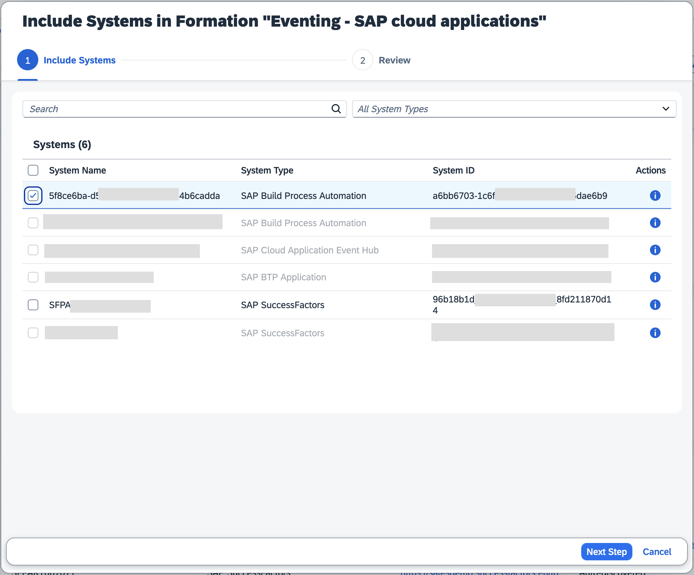
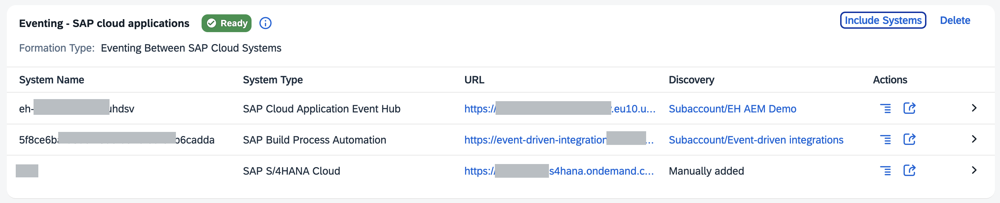
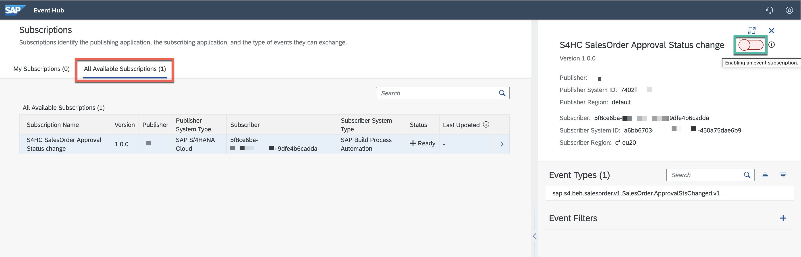

# Set up SAP Build Process Automation connectivity with SAP Cloud Application Event Hub

<!-- description -->Learn how we can configure the connectivity between SAP Build Process Automation and SAP Cloud Application Event Hub

## Prerequisites

- You've completed the previous tutorial: [Set up SAP Cloud Application Event Hub](../eh-setup-event-hub/eh-setup-event-hub.md).
- You are familiar with the concepts explained in the [SAP Cloud Application Event Hub - Basic Concepts](eh-basic-concepts.md) tutorial.
- The publisher system is already configured in your system landscape and it is part of the formation used to enable eventing between SAP cloud systems.
- You have access to an SAP Build Process Automation system and an instance of SAP Cloud Application Event Hub in your SAP BTP account.

## You will learn

- How to configure the connectivity between SAP Build Process Automation and SAP Cloud Application Event Hub

## Intro

Now that we are familiar with the basic concepts of SAP Cloud Application Event Hub, we can proceed to configure the connectivity between SAP Build Process Automation and SAP Cloud Application Event Hub. For this, we will be interacting with the SAP BTP cockpit and the SAP Build Process Automation system. In the SAP BTP Cockpit global account, the SAP Build Process Automation instances that we have created in a subaccount will be automatically added as a systen in our system landscape.

### Enable event exchange between SAP Build Process Automation and SAP Cloud Application Event Hub

As the SAP Build Process Automation system was automatically added to the SAP BTP global account, we can proceed to include it in a formation. The formation will need to be of type `Eventing between SAP cloud systems` to enable the event exchange.

1. In the SAP BTP cockpit, navigate to the **Formations** section, choose the **Include Systems** button in the formation. 

    

2. In the pop-up, select the SAP Build Process Automation system you just registered. Then, choose the **Next Steps** button.

    

Once the formation finishes synchronizing, the SAP Build Process Automation system will be part of the formation and we will be able to configure integration dependencies so that events start flowing to SAP Build Process Automation.

### Configure events from SAP S/4HANA Cloud

In order to get events flowing from SAP S/4HANA Cloud to SAP Build Process Automation via SAP Cloud Application Event Hub, we need to define integration dependency for the system in a formation.

1. In the SAP BTP cockpit - **Systems** page, select the SAP Build Process Automation system and then choose the **Add** button in the **Integration Dependencies** section.

    

2. In the popup, we will select the **Simplified Business Eventing Template**, then choose the **Next Step** button.
    

    Now, as we define the integration dependency, we specify the following information:

   1. `Name`: Enter a meaningful name for the integration dependency.
   2. `Description`: A description of the integration dependency.
   3. `Publishing System Namespace`: The namespace of the system that will be producing the events. We can find the namespace of a system by navigating to the System Landscape, selecting the system, and then going to the Details tab.
   4. `Event Types`: The types of events that the consuming system is interested in.

    

3. Once we've defined all the event types that the consuming system is interested in, we can choose the **Review** button and then choose **Add** to save the integration dependency.

The new integration dependency will now be listed as an available subscription in the SAP Cloud Application Event Hub UI. We can then enable it to start the exchange of events between the systems.

### Enable subscriptions in SAP Cloud Application Event Hub

Once an integration dependency is defined for a system in a formation, this dependency will be listed as a subscription in SAP Cloud Application Event Hub. As an administrator of Event Hub, we can then enable or disable the event subscription to start or stop the exchange of events between the systems defined in the integration dependency.

1. Access the SAP Cloud Application Event Hub UI.
2. Navigate to the **Available Subscriptions** section. Here, we will see the integration dependency we just created listed as a subscription.
3. Select the subscription and toggle the **Enable** button.
    

### Further study

You can check out the following resources to learn more about the SAP S/4HANA Cloud and SAP Cloud Application Event Hub integration:

- Integration with SAP Cloud Application Event Hub: [link](https://help.sap.com/docs/SAP_S4HANA_CLOUD/0f69f8fb28ac4bf48d2b57b9637e81fa/8ed53ec0f7544d7c8342db6e617127a1.html)
- Linking SAP Fiori Launchpad to SAP Cloud Application Event Hub: [link](https://help.sap.com/docs/abap-cloud/abap-integration-connectivity/managing-event-distribution-models)