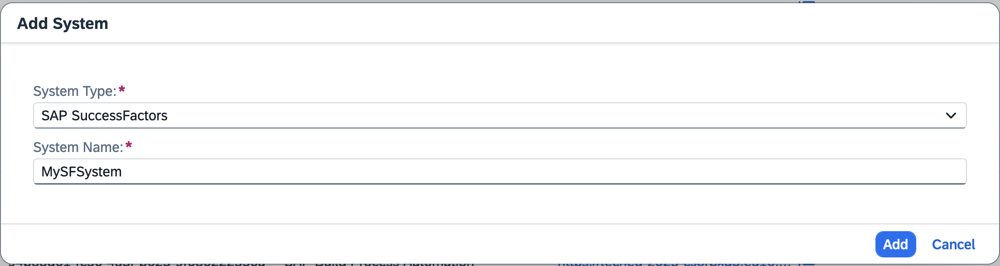
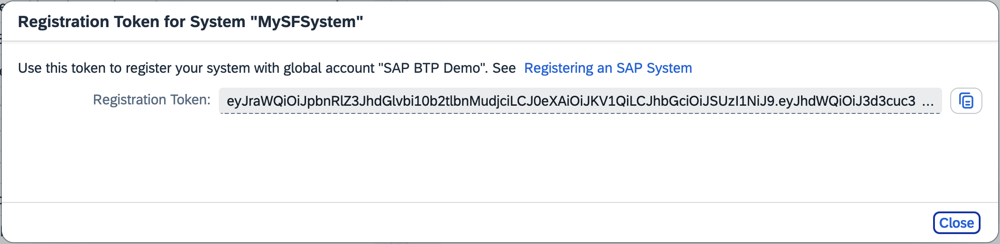
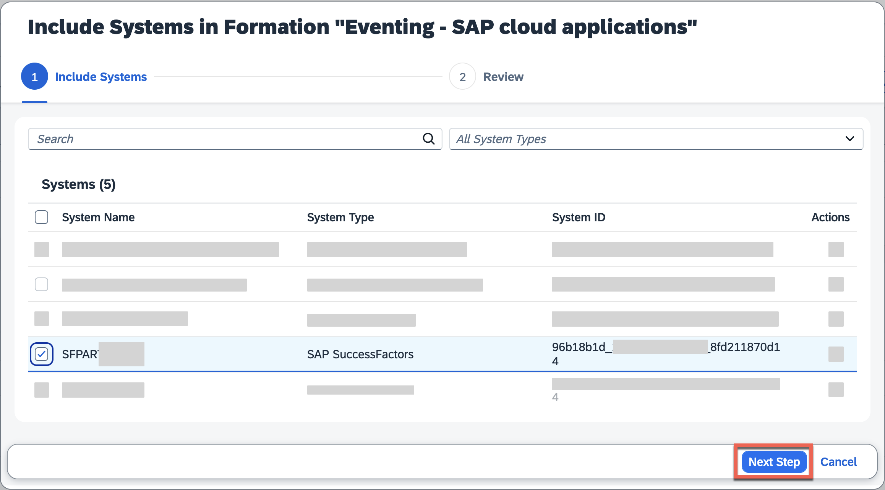
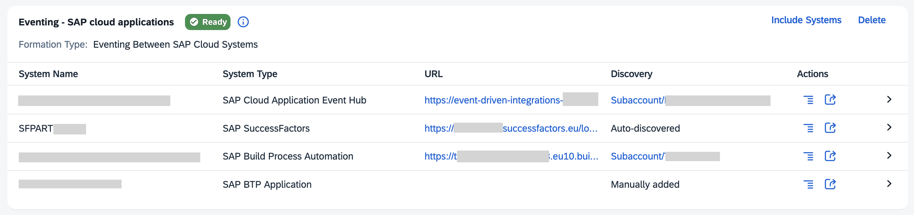

# Set up SAP SuccessFactors connectivity with SAP Cloud Application Event Hub

<!-- description -->Learn how we can configure the connectivity between SAP SuccessFactors and SAP Cloud Application Event Hub

## Prerequisites

- You have access to an SAP SuccessFactors system and an instance of SAP Cloud Application Event Hub in your SAP BTP account.
- You've completed the previous tutorial: [Set up SAP Cloud Application Event Hub](../eh-setup-event-hub/eh-setup-event-hub.md).

## You will learn

- How to configure the connectivity between SAP SuccessFactors and SAP Cloud Application Event Hub

## Intro

Now that we are familiar with the basic concepts of SAP Cloud Application Event Hub, we can proceed to configure the connectivity between SAP SuccessFactors and SAP Cloud Application Event Hub. For this, we will be interacting with the SAP BTP cockpit global account. In the SAP BTP Cockpit we will add the system and once we've achieve this, we will include it in the formation.

### Add the SAP SuccessFactors system in the SAP BTP system landscape

Depending on how your SAP BTP global account is setup, an SAP SuccessFactors system may already be registered in your SAP BTP global account. If not, follow the steps below to add an SAP SuccessFactors system in the SAP BTP global account.

1. Go to the SAP BTP cockpit and navigate to the **Systems** within the **System Landscape** section. Here you will find all systems registered in your system landscape. Given that we've already created an instance of SAP Cloud Application Event Hub, you will see it listed here.

2. Choose the **Add System** button. Set the **System Name** and select `SAP SuccessFactors` as the **System Type**. Then select the **Get Token** button to generate a registration token.

    

3. Copy the token generated from the dialog by selecting the **Copy to Clipboard** button. This token will be used to connect your SAP SuccessFactors tenant with the SAP BTP global account.

    

4. In SAP SuccessFactors, go to the **Admin Center**, navigate to **Extension Center**. On the **Extensions on SAP BTP** tab page, navigate to the **Add Integration with SAP BTP**, and paste the registration token in the **Integration Token** field. Finish by choosing the **Add** button.

### Enable event exchange between SAP SuccessFactors and SAP Cloud Application Event Hub

Now that we have the SAP SuccessFactors system registered in our SAP BTP global account, we can proceed to include it in a formation. The formation will need to be of type `Eventing between SAP cloud systems` to enable the event exchange.

1. In the SAP BTP cockpit, navigate to the **Formations** section, choose the **Include Systems** button in the formation.

    

2. In the pop-up, select the SAP SuccessFactors system you just registered. Then, choose the **Next Steps** button.

    

Once the formation finishes synchronizing, the SAP SuccessFactors system will be part of the formation. SAP Cloud Application Event Hub will take of the necessary communication between SAP SuccessFactors and itself. The SAP SuccessFactors system is now ready to start publishing events to SAP Cloud Application Event Hub.

> For SAP SuccessFactors Employee Central events, we have to enable the following configurations:
>
> 1. Complete the steps described in the [Employee Central HRIS Events topic](https://help.sap.com/docs/successfactors-platform/using-sap-successfactors-events-on-sap-cloud-application-event-hub/a47ba97c9c30449bb8655a959e06b512.html?locale=en-US&state=PRODUCTION&version=2511).
> 2. Enable **Integrating Employee Central Group Events with SAP Cloud Application Event Hub** in **Upgrade Center**.

### SAP SuccessFactors events available in SAP Cloud Application Event Hub

SAP SuccessFactors is adopting SAP Cloud Application Event Hub as the central platform for publishing events. Check out the SAP Help documentation to see the events published by SAP SuccessFactors Onboarding, SAP SuccessFactors Employee Central, and SAP SuccessFactors Recruiting to SAP Cloud Application Event Hub:

<https://help.sap.com/docs/successfactors-platform/using-sap-successfactors-events-on-sap-cloud-application-event-hub/sap-successfactors-events-available-in-sap-cloud-application-event-hub>

### Further study

You can check out the following resources to learn more about the SAP SuccessFactors and SAP Cloud Application Event Hub integration:

- [Register an SAP SuccessFactors System in a Global Account in SAP BTP](https://help.sap.com/docs/btp/sap-business-technology-platform/register-sap-successfactors-system-in-global-account-in-sap-btp)
- [SAP SuccessFactors events on SAP Cloud Application Event Hub](https://help.sap.com/docs/successfactors-platform/using-sap-successfactors-events-on-sap-cloud-application-event-hub/sap-successfactors-events-on-sap-cloud-application-event-hub)
- [SAP SuccessFactors Events Available in SAP Cloud Application Event Hub](https://help.sap.com/docs/successfactors-platform/using-sap-successfactors-events-on-sap-cloud-application-event-hub/sap-successfactors-events-available-in-sap-cloud-application-event-hub)
