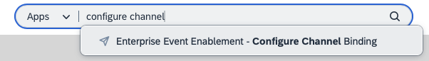

# Configure outbound events in SAP S/4HANA Cloud

<!-- description -->Learn how you can configure outbound events in SAP S/4HANA Cloud to SAP Integration Suite, advanced event mesh.

## Prerequisites
- You have access to an SAP S/4HANA Cloud system and an SAP Integration Suite, advanced event mesh tenant
- You've completed the previous tutorial: [Set up SAP S/4HANA Cloud connectivity with SAP Integration Suite, advanced event mesh](../setup-s4hc-aem/setup-s4hc-aem.md) or have the connectivity between SAP S/4HANA Cloud and SAP Integration Suite, advanced event mesh configured.

## You will learn
- How to configure outbound events in SAP S/4HANA Cloud
- How to monitor events in SAP S/4HANA Cloud

## Intro
Now that you've established a connection between SAP S/4HANA Cloud and SAP Integration Suite, advanced event mesh. In this tutorial, you will configure the Business Partner changed event in the communication channel that you've created for SAP Integration Suite, advanced event mesh.

### Configure outbound events in SAP S/4HANA Cloud

Log in to the SAP S/4HANA Cloud system and navigate to the **Enterprise Event Enablement - Configure Channel Binding** app.

Select the channel binding that you created in the previous tutorial, for example **AEM_USEASTBROKER**.

Click the **Create** event button in the **Outbound Topic Bindings** section, search for the **\*BusinessPartner/Changed\*** topic and select the **sap/s4/beh/businesspartner/v1/BusinessPartner/Changed/v1** topic. Click the **Create** button.

Now that you've added the topic, you can see the **Outbound Topic Bindings** section with the **BusinessPartner Changed** topic.

### Modify an existing Business Partner

Go to the **Maintain Business Partner** app and search for a Business Partner to maintain.

Modify an existing Business Partner. For example, you can update its address details.

### View event in the Monitoring app

Now that you've changed a Business Partner, you navigate to the **Enterprise Event Enablement - Event Monitor** app.

Select the same channel selected before, for example **AEM_USEASTBROKER**.

An outbound event should be displayed in the **Outbound Events** section.

If you select the event, you can see the details of the event and event the payload sent. This is useful to see the structure of the event and the data sent.

<!-- ### View event in SAP Integration Suite, advanced event mesh

Log in to SAP Integration Suite, advanced event mesh tenant.

Connect to the event broker service.

Access the Try Me feature.

Connect to the event broker service and subscribe to the Business Partner changed event.

The event should be display in the event broker service. -->

