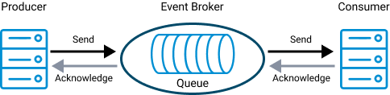
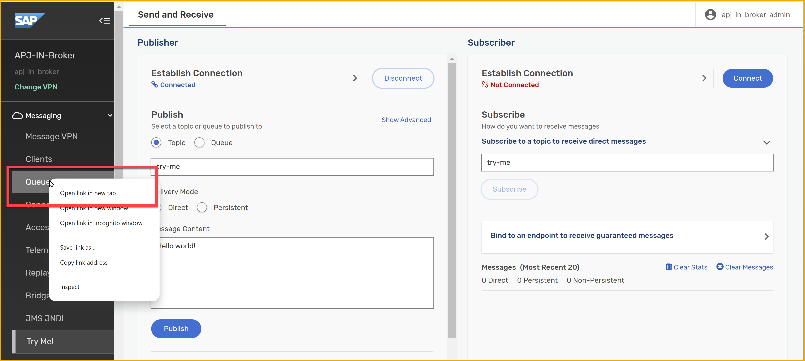
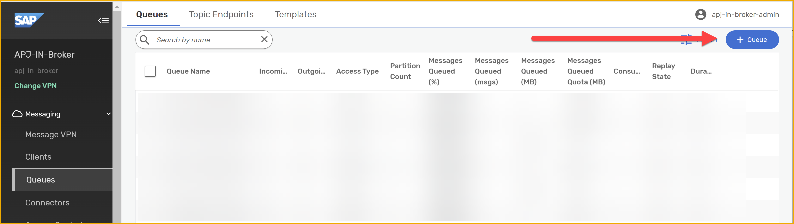
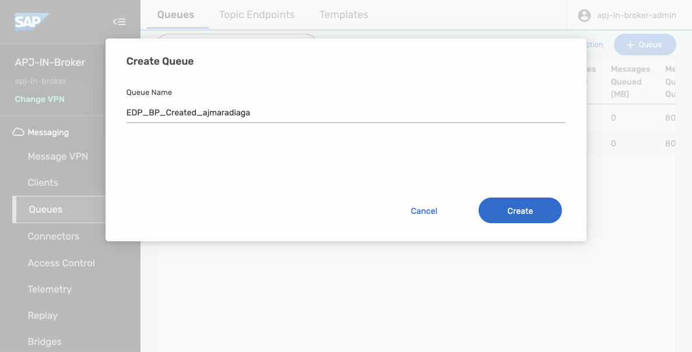
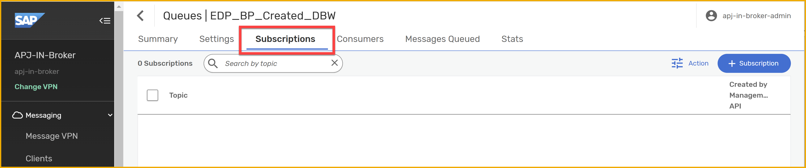
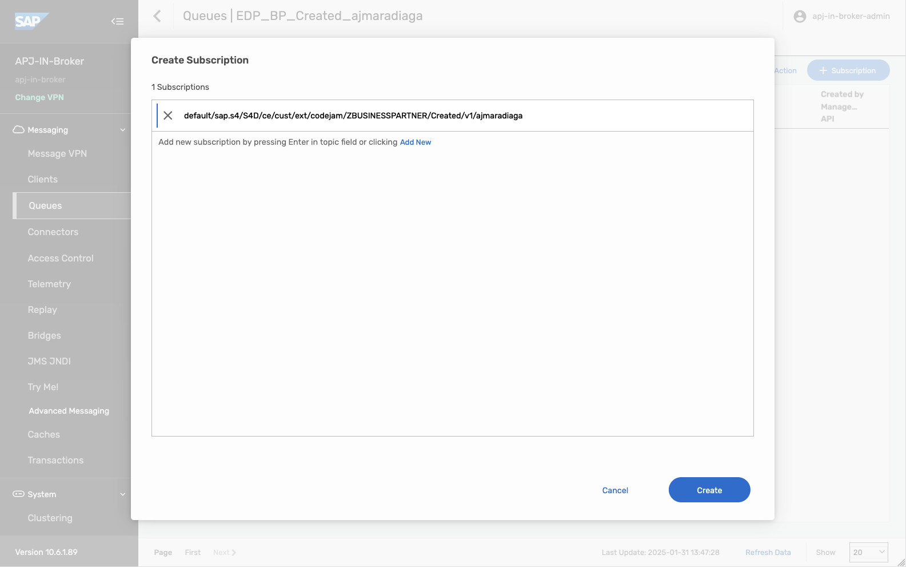
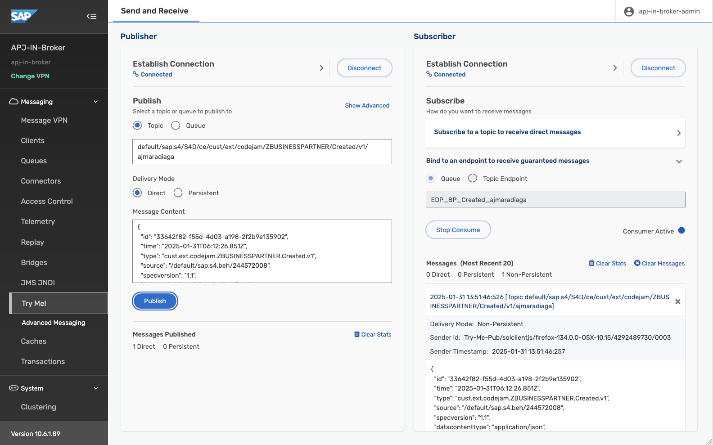

# Queues and subscriptions in SAP Integration Suite, advanced event mesh

<!-- description -->Learn how we can configure queues and topic subscription so that we don't a consumer doesn't miss any events emitted by a publisher.

## Prerequisites
- You have access to an SAP Integration Suite, advanced event mesh tenant.

## You will learn
- How to create a queue in an SAP Integration Suite, advanced event mesh event broker service
- How to add topic subscriptions to a queue
- How to consume message from a queue in the Try Me! page

## Intro
In some scenarios, it is unacceptable to miss any events and we need to ensure that we receive and process all messages published. Fortunately, there is a mechanism to retain messages without the need for a consumer service to be online 100% of the time. Then, the consumer can process the messages asynchronously or whenever it is available. Enter **Queues**.

### Queues

Queues allow us to subscribe to one or more topics and receive messages for all topics matching their subscriptions. The messages are received by the messaging system, saved in the queue and delivered to consuming clients if they are online and connected or held in the queue until the consumer becomes available. 

Queues can provide exclusive access to one consumer or access to multiple consumers where messages are distributed among the consumers. The message will be in the queue until a consumer acknowledges that a message has been processed. Only then the message will be removed from the queue.

In the case of AEM, queues can be durable or non-durable:

- **Durable queues** exist until they are removed by an administrative action. They accumulate messages whether clients are online or offline. When offline clients reconnect, they receive all of the messages that accumulated while they were offline.

- **Temporary (or non-durable) queues** follow the lifecycle of the client connection and are useful for ensuring message persistence while clients are online. Once the client disconnect, the queue disappears.

### Topic subscription

As mentioned before, we can subscribe to a topic directly. A topic subscription is created after establishing a connection to AEM. We achieved this in the [previous tutorial](../pubsub-view-events/), when we subscribed to the `try-me` topic in the **Subscriber** section of the **Try Me!** page. 

This is not a polling mechanism, but a running connection is needed, through which AEM will send a message to the subscriber. In this case, the web page. If there is no subscriber available, the message will be missed.

In the case of a queue, which is subscribed to topics, a message sent to a topic will be stored in the queue until a consumer is available to process it. This is a more reliable way to ensure that messages are not lost.

### Topic endpoint

In AEM there is a concept of a **Topic Endpoint**. A topic endpoint is a durable storage for messages that are published to a topic. It is also a way to ensure that messages are not lost if there are no subscribers available to receive them. It is in a way similar to a queue but it has some limitations:

- A topic endpoint can only be used for a single topic. Queues can subscribe to multiple topics.

- A producing application can publish messages directly to a queue by referencing the queue by its name. A topic endpoint can only be used to store messages published to a topic, and it is not possible to reference it by name in the same way as a queue.

- A topic endpoint doesn't allow reading messages without removing them. A queue supports this.

### Create a Queue

> 🚨 Before we create a queue, make sure you open the `Queues` link in a new tab, so that you don't have to re-enter the credentials in the `Try Me!` page and connect again to the event broker.

1. Select the **Queues** link on the left side and **Open in a New Tab**to see the queues in the event broker service. 

    

2. On the right of the new tab, click **+ Queue**.
   
    
   
    Enter the name of the queue.

    

    Click **Create**.
    
3. Leave all the default settings, and click **Apply**. 

    Our queue has no subscriptions at the moment, so let's go ahead and add a subscription to the Business Partner topic, e.g. `default/sap.s4/S4D/ce/sap/s4/beh/businesspartner/v1/BusinessPartner/Created/v1`.

4. Click on the queue you just created.
   
5. Go to the **Subscriptions** tab.
    
    
    
    Click **+ Subscription** on the right side. 
    
    Enter the topic name, `default/sap.s4/S4D/ce/sap/s4/beh/businesspartner/v1/BusinessPartner/Created/v1`.

    

    Click **Create**.

### Subscribe to a Queue
Now that we have created a queue, let's subscribe to it in the **Try Me!** page.

1. Go back to the previous tab, which is the **Try Me!** page.

    On the publisher side, you should still be signed in.
    
2. Click **Connect** on the subscriber side. It should grab the credentials from the publisher side.

    >If not, provide them again.

3. Expand the **Bind to an endpoint to receive guaranteed messages** section.

    Enter the queue name in the text box.

    Click **Start Consume**.

    

    If you've published a message after creating the queue, some messages would have been accumulated in the queue and they will be displayed in the UI. If not, publish a new message, and your queue will receive it and it will then be displayed in the UI.

>🧭 Take some time to explore further what we've learned in this tutorial. Some ideas:
>
>- Publishing:
>
>   - Try publishing some additional messages on the topic and see how they are received in the subscriber section.
>
>   - Change the delivery mode before publishing a message and see how it affects the message delivery. 
>
>   - Changing the topic where it is published.
>
>- Manage your queue:
>
>   - Add new topic subscriptions to your queue.
>
>   - Look at the stats of your queue.
>
>   - When consuming messages from Try Me! page, check the Consumers listed in the Queue.
>
>- Stop consuming messages from the queue and see how the messages are accumulated in the queue. Check the queue stats in `Queues`.

### Further study

We've covered a few things in this tutorial. We've learned about topic subscriptions, queues, and how to publish and subscribe to events in the event broker service using the `Try Me!` page. We've also learned about the different types of queues, durable and non-durable, and how they can be used to ensure that messages are not lost if the consumer is offline. We created a queue, subscribed to a topic and consumed messages. These are activities that we will do more in future exercises.

- Topic endpoints and Queues - [link](https://help.pubsub.em.services.cloud.sap/Get-Started/topic-endpoints-queues.htm)
- Understanding Solace endpoints: Queues vs Topic endpoints - [link](https://solace.com/blog/queues-vs-topic-endpoints/)
- Consuming messages from a queue - [link](https://help.pubsub.em.services.cloud.sap/Cloud/Consuming-Guaranteed-Messages-from-Queue-in-Broker-Manager.htm)
- Message delivery modes - [link](https://help.pubsub.em.services.cloud.sap/Get-Started/message-delivery-modes.htm)
- Direct Messaging - [link](https://docs.solace.com/Messaging/Direct-Msg/Direct-Messages.htm)
- Guaranteed Messaging - [link](https://docs.solace.com/Messaging/Guaranteed-Msg/Guaranteed-Messages.htm)

>**Things to Ponder**
>
> 1. Which wildcard can you use to receive all events, independent of levels, for Business Partners?
> 2. Some queues can be configured to have multiple consumers. Can you think of a scenario where this would be useful?
> 3. On the Queues page of our event broker service, there were some queues whose names started with a #. What do you think this means?
