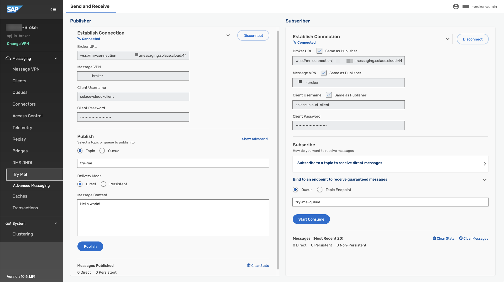
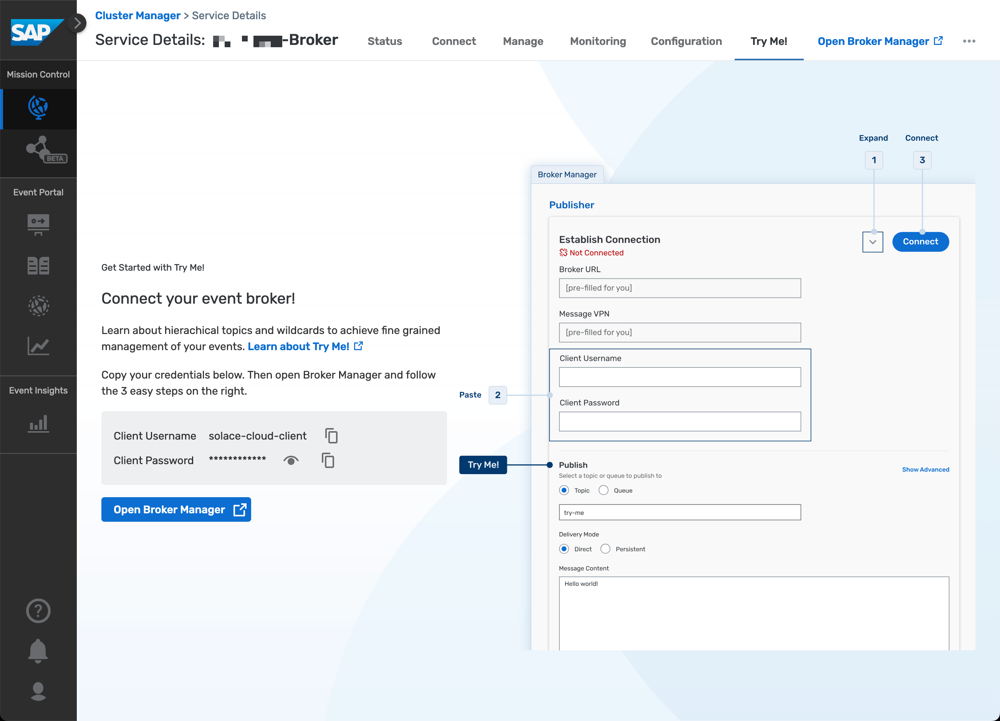
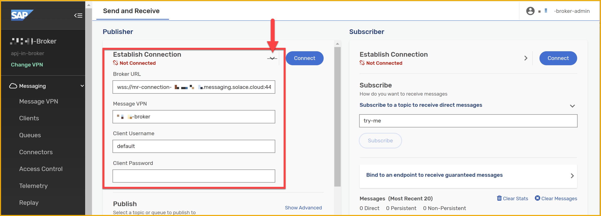
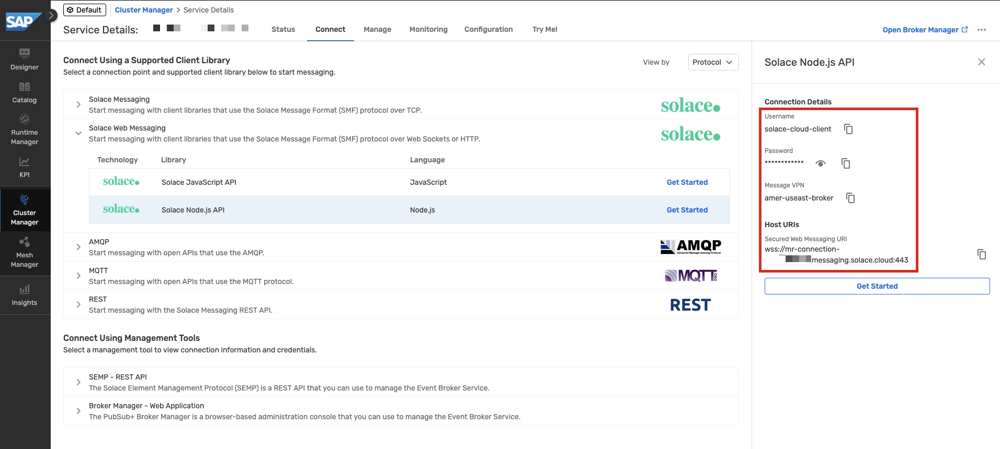
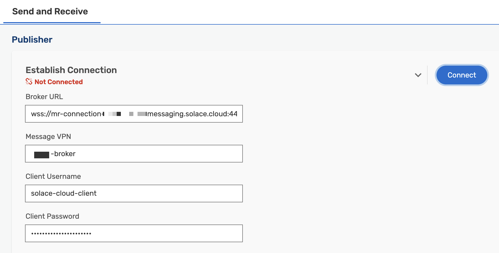
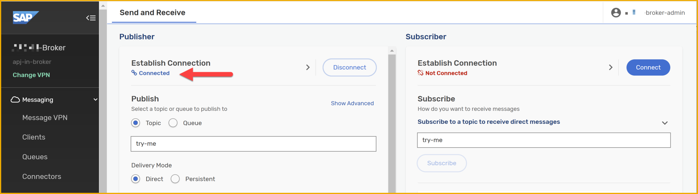
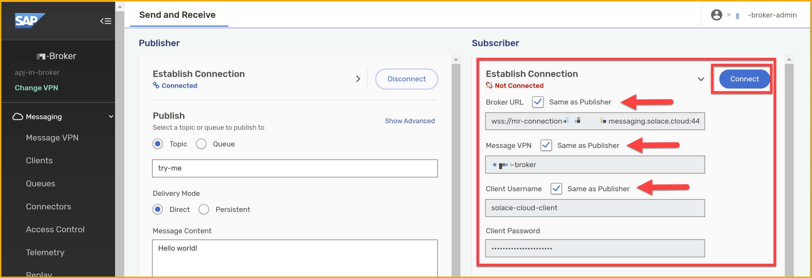
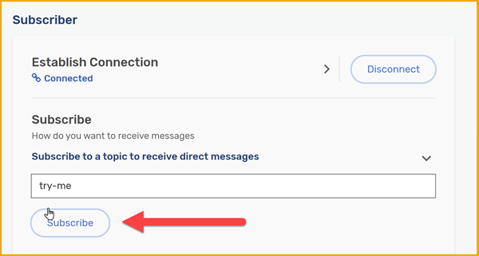

# Publish and Subscribe to Events in SAP Integration Suite, advanced event mesh
<!-- description -->Dive deeper into the message exchange, still by using the UI in AEM, and also explore a different section through which you can exchange messages.

## Prerequisites
- You have access to an SAP Integration Suite, advanced event mesh tenant. 

## You will learn
- What are topics, subscriptions
- How to send and receive messages using `Try Me!` page in the event broker service

## Intro
We are now familiar with the basic UI elements in SAP Integration Suite, advanced event mesh (AEM). 

In this tutorial, we will dive deeper into the message exchange, still by using the UI in AEM and we will also explore a different section through which you can exchange messages. Before we get to the exercise, we might need to expand a bit on some concepts. 

Let's get started.

### What is topic?

In a previous exercise, we mentioned that a topic is a means by which a publisher classifies a message. A topic tells us what type of message we will receive if we subscribe to that topic.

In essence, it is a string that is composed of one or more levels. Each level is separated by a forward slash (/) and the levels can be anything. This is commonly known as topic-level granularity. The granularity allows for more targeted and efficient information exchange. 

Instead of having a single topic for all updates on a business object in a complex system (/BusinessPartner), the system can have distinct topics for different types of updates on a business object (/BusinessPartner/Created, /BusinessPartner/Updated, /BusinessPartner/Deleted). 

There is no specific schema/specification on how you need to structure your topic string but you do find that patterns are established within a system. Let's get familiar with the structure of a topic by "dissecting" a real-world topic. 

Below we can see a topic on which an SAP S/4HANA Cloud system will publish a Business Partner message.

Example: `default/sap.s4/S4D/ce/sap/s4/beh/businesspartner/v1/BusinessPartner/Created/v1`:

- *default/sap.s4/S4D*: System information.
- */ce*: CloudEvent. We know that all events published by an SAP S/4HANA Cloud system follow the CloudEvent specification
- */sap/s4*: This is coming from an SAP S/4HANA system.
- */beh/businesspartner/v1/BusinessPartner*: Information of the business object that we will be receiving.
- */Created*: This is the action that took place in the source system. In this case, it is notifying us that a Business Partner was created. Many actions can take place in a system, for example, `/Updated` or `/Deleted`. In other cases, if we were dealing with a business object like a Purchase Order, there could be an event raised when it is `/Cancelled` or `/Rejected`.
- */v1*: Version of the message. If a new version of the message is made available – adding new fields to the payload – then this will change.

Now, by knowing the topic on which a message type will be published, we can create a consumer program/service that subscribes to the topic directly and processes the messages sent to it. Generally, you can subscribe to a topic by specifying the entire topic string when establishing the connection – for example, *default/sap.s4/S4D/ce/sap/s4/beh/businesspartner/v1/BusinessPartner/Created/v1*. 

But what if we want to subscribe to all actions (Created, Updated, Deleted) that occur on a BusinessPartner object? 

Luckily, in the case of SAP Integration Suite, advanced event mesh, we can subscribe to the topic by using wildcards (\*). For example, by subscribing to the topic ***default/sap.s4/S4D/ce/sap/s4/beh/businesspartner/v1/BusinessPartner/\*/v1*** we will be able to get all messages for different actions (Created, Updated, Deleted) whose version is v1.

In AEM, the `>` character can be used at the last level of a subscription to indicate a "one or more" wildcard match for any topics – for example, by subscribing to the topic *default/sap.s4/S4D/ce/sap/s4/beh/>* will bring all objects that are published under that prefix, independent of type, action, and version.

>In the example above we can see how the topic level granularity can allow a consumer program/service to subscribe only to the information it needs. 
>
>Learn more about wildcard characters in topic subscriptions: [https://help.pubsub.em.services.cloud.sap/Messaging/Wildcard-Charaters-Topic-Subs.htm](https://help.pubsub.em.services.cloud.sap/Messaging/Wildcard-Charaters-Topic-Subs.htm)

If our consumer program/service subscribes to a topic, we will receive all messages for that topic subscription. That said, a direct topic subscription lasts only as long as the consumer is connected. The problem here is that our consumer needs to be online to receive a message. If the consumer becomes unavailable then we will end up losing the message. 

In some scenarios, this is unacceptable and we need to ensure that we receive and process all messages published. Fortunately, there is a mechanism to retain messages without the need for a consumer service to be online 100% of the time. Then, the consumer can process the messages asynchronously or whenever it is available.

### Basic message exchange

Navigate to **Cluster Manager**, and go to the event broker service configured. You will land in the `Status` tab of the service.

In the event broker service, go to the **Try Me!** tab.

From here, we will be able to access the Try Me! functionality that's available from within the event broker service. Through it, we can connect to the event broker, publish messages to it and also consume messages sent to topics. This is a great way to quickly test the event broker service and exchange simple messages.

Just as a quick test, let's use the Try Me! functionality to quickly establish a connection and exchange a message. We will achieve the communication scenario below.

In the **Try Me!** tab, follow the instructions below:

1. Click on the `Open Broker Manager` button.

    
    
2. On the `Publisher` side, expand the area for entering the credentials.
  
    

3. From the **Connect** tab in the event broker service, get the credentials for the **Solace Web Messaging** protocol: `Host URIs` -> `Broker URL`, `Message VPN`, `Username` -> `Client Username` and `Password` -> `Client Password`.

    

    

4. Click **Connect**.

    You should now see **Connected**.

    

5. On the `Subscriber` side, expand the credentials area, and select **Same as Publisher** checkboxes for the first three credentials.

    

    Click **Connect**.

6. After establishing the connection, subscribe to the topic `try-me` by clicking the **Subscribe** button.

    

7. Back on the **Publisher** side, publish a message to the topic `try-me` by clicking the **Publish** button.

    Check the message being consumed on the **Subscriber** side.

    

> **Delivery Mode**
>
> In the example above we've not changed the Delivery Mode. Two delivery modes are possible in AEM, Direct and Persistent. By default, the delivery mode will be `Direct` which can have some limitations in terms of message delivery. For example, the message doesn't require acknowledgment of receipt by subscribing clients and messages aren't retained for a client when it's not connected to an event broker. This means that we can end up losing messages and in some scenarios, this is perfectly fine and acceptable but that might not be the case always. Fortunately, we are also able to change the delivery mode to `Persistent` which ensures that messages are retained in the event broker until they are acknowledged by the consumer. It keeps a copy of the message until successful delivery to all clients and downstream event brokers has been verified. This will be a more reliable way to ensure that messages are not lost.

### Subscribe to SAP S/4HANA Cloud events in the Try Me! page

Now that we are familiar with how we can publish and subscribe to messages in the **Try Me!** page, let's explore how we can subscribe to SAP S/4HANA Cloud events.

1. On the `Subscriber` side, add a new topic `default/sap.s4/S4D/>` and click the **Subscribe** button.

2. Trigger an event from the SAP S/4HANA Cloud system. For example, if you configure the Business Partner created event, this should be published to a topic like: `default/sap.s4/S4D/ce/sap/s4/beh/businesspartner/v1/BusinessPartner/Created/v1`.

3. You should be able to see the message being consumed on the **Subscriber** side.

### Further study

We've covered a lot in this tutorial. We've learned about topics, how to publish and subscribe to events in the event broker service using the `Try Me!` page.

- Message delivery modes - [link](https://help.pubsub.em.services.cloud.sap/Get-Started/message-delivery-modes.htm)
- Direct Messaging - [link](https://docs.solace.com/Messaging/Direct-Msg/Direct-Messages.htm)
- Guaranteed Messaging - [link](https://docs.solace.com/Messaging/Guaranteed-Msg/Guaranteed-Messages.htm)

>**Things to Ponder**
>
> 1. Which wildcard can you use to receive all events, independent of levels, for Business Partners?
