# Set up SAP Integration Suite, advanced event mesh
<!-- description -->Learn to create an instance of SAP Integration Suite, advanced event mesh (AEM), and get familiar with some of key parts of the product.

## Prerequisites
- If you are completing the Get started with SAP Integration Suite, advanced event mesh mission, you must have access to an SAP BTP enterprise account.
- SAP Integration Suite, advanced event mesh requires an Identity Authentication tenant to be configured in the subaccount. If you don't have one, please refer to [Tenant Model and Licensing](https://help.sap.com/docs/IDENTITY_AUTHENTICATION/6d6d63354d1242d185ab4830fc04feb1/93160ebd2dcb40e98aadcbb9a970f2b9.html?version=Cloud) or [SAP Business Technology Platform Bundle](https://help.sap.com/docs/IDENTITY_PROVISIONING/f48e822d6d484fa5ade7dda78b64d9f5/eb7ce66c895f4301b95b5c2f285d6667.html?version=Cloud). Once you have the tenant, you need to establish a trust configuration in the subaccount with the IAS tenant. More details included here: [Establish Trust and Federation Between UAA and Identity Authentication](https://help.sap.com/docs/BTP/65de2977205c403bbc107264b8eccf4b/161f8f0cfac64c4fa2d973bc5f08a894.html?locale=en-US&version=Cloud).

## You will learn
- How to create an instance of SAP Integration Suite, advanced event mesh.
- How to access the SAP Integration Suite, advanced event mesh.
- How to get around the UI.

## Intro
In this tutorial, you will setup AEM, start interacting with it and you will get familiar with some key parts of the product.

### Create and access an instance of SAP Integration Suite, advanced event mesh

1. Log in to your SAP BTP account and navigate to `Services` > `Instances and Subscription`. Choose the `Create` button.

    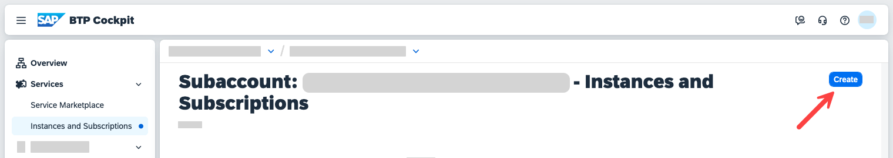

2. In the popup, select the service SAP Integration Suite, advanced event mesh and select the plan `standard`. 
3. Once the instance is created, you can choose the instance name to access the AEM instance.

    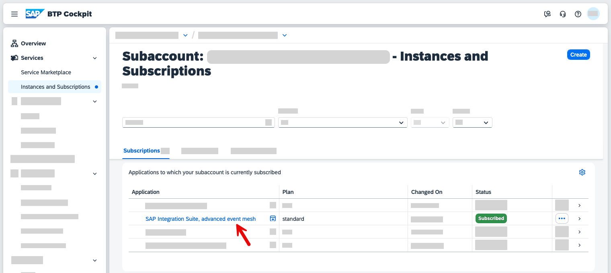

You'll automatically sign in to AEM and go to the start page.

### Advanced Event Mesh start page

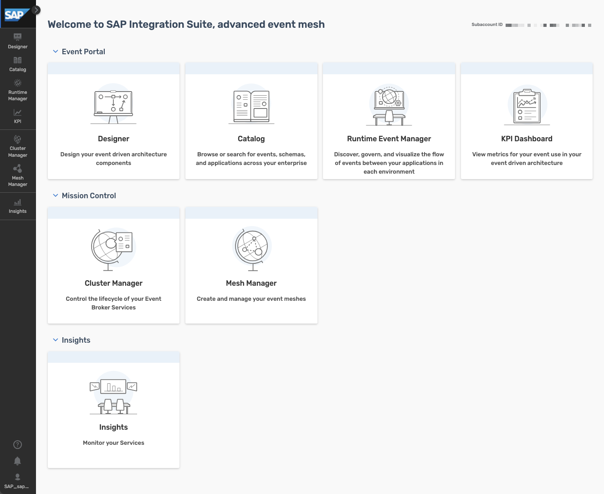

The start page is divided into three sections:

- **Event Portal:** Here you can access the cluster and mesh managers, through which you can manage the event brokers and event meshes in our instance.
- **Mission Control:** The different event management services are available here. For example, the Event Portal, through which you can create, design, share, and manage various aspects of your EDA based on event brokers or other streaming technologies.
- **Insights:** AEM has dashboards and visualizations available out of the out-of-the-box. Through here you are able to monitor the event brokers deployed.

### What is Mission Control?

Mission Control is where you manage the event broker services and event meshes (which contain a bunch of event broker services), and monitor the health of our AEM instance.

>**IMPORTANT:** Your AEM instance will not have any event broker services or an event mesh. The images below are just an example of what it will look like once you have a fully configured AEM with multiple event broker service instances.

Mission control is divided into two sections:

- **Cluster Manager:** Here, you can find the event broker services available in your instance, and you can create, configure and delete event brokers.

    👉 Navigate to **Cluster Manager** and view the event broker services available. 

    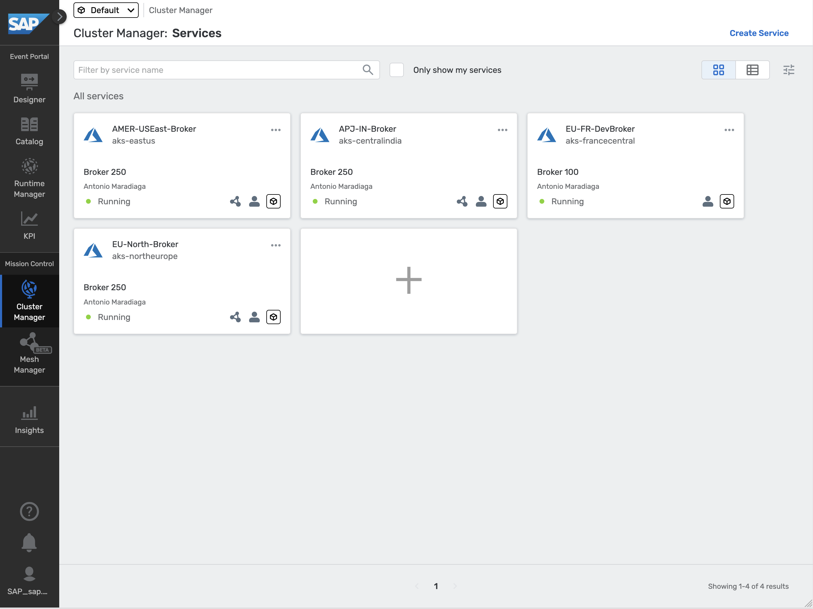

- **Mesh Manager:** Here, you can create and manage our event meshes. An event mesh is composed of multiple event brokers that can span different data centers. An event broker can only belong to one mesh.

    👉 Navigate to **Mesh Manager** and view the event mesh available

    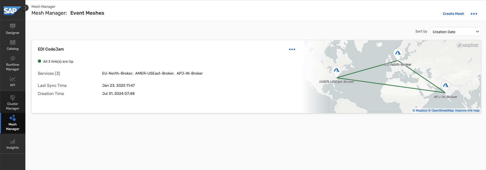

### Create an event broker service

In order to create an event broker service, follow the steps below:

1. Choose the **Cluster Manager** and choose the **Create Service** button.

    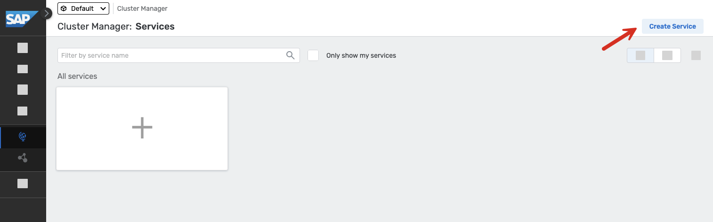

2. Enter a service name, select a Cloud Provider, Region, a Broker Release and Broker Version. Finally, a service type. To select the right service type, you need to know and understand the requirements of your client applications, for example:

    - Number of client applications connecting simultaneously.
    - Maximum throughput.
    - Number of queues required.
    - Type of traffic exchanged between client applications.

    > To learn more about how to choose the right service class, visit the [documentation](https://help.pubsub.em.services.cloud.sap/Cloud/ght_pick_service_type.htm).

    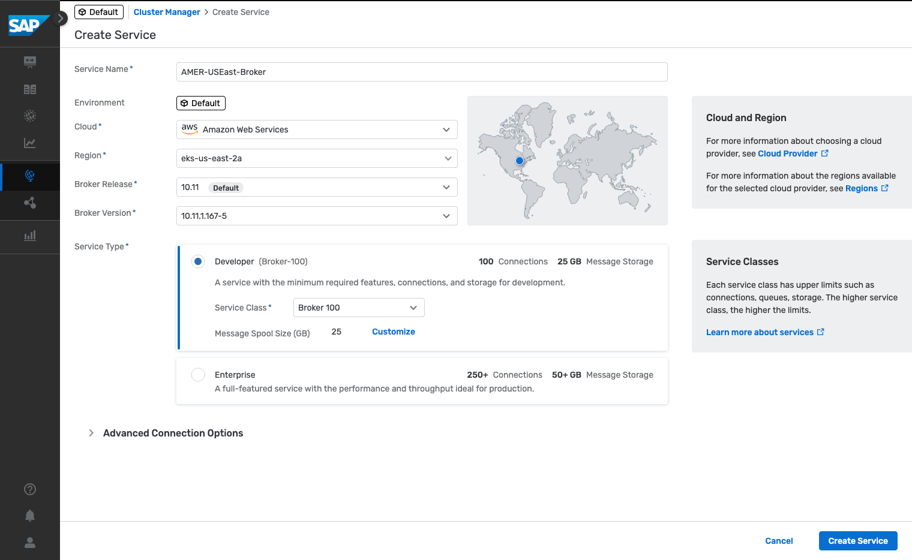

3. Choose the **Create Service** button and wait for the service to be created. This can take a couple of minutes.  

> For simplicity purposes you will refer to the event broker service as `AMER-USEast-Broker` in this tutorial. In this case, the name of the event broker service reflects the region where the broker is located but you can name it whatever you want.

#### Event Broker services

The event broker service is the main object that you interact with in AEM. It is the service that provides the messaging capabilities to our client applications. An event broker service can be created in different cloud providers, be deployed to different regions, be part of a cluster and also be part of a mesh.

In our case, you have only one event broker services, the event broker service you've set up.

Now, let's explore the event broker service available in our instance.

1. Navigate to **Cluster Manager**, and go to the event broker service created. You will land in the Status tab of the service. Get familiar with the information available.

    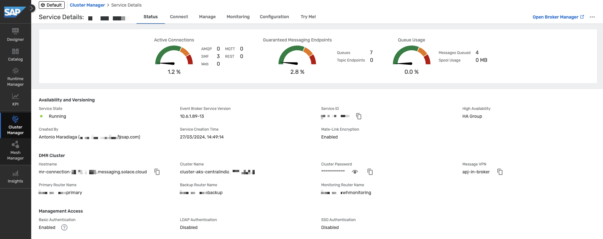

    In the **Status** tab, you will be able to get an overall status of the event broker service, know the number of active connections, the number of queues used, the state of the service, its version, when was it created, who created it, if it is part of a high availability group. Also, you'll see if this event broker service is part of a mesh. 

2. In the **AMER-USEast-Broker** event broker service, go to the **Connect** tab.    

    In the dropdown on the right side, select to **View by: Protocol**.  Now, expand the `REST` section part of the accordion and select the `Solace REST Messaging API` element. The connection details will be displayed on the right side of the screen.

    In the ***Connect*** tab, you can see the connection details available for the event broker service depending on the protocol you want to use – for example, the host, the port, the username and the password to connect to the event broker service.
    
    Depending on the protocol you use to connect, sometimes you might also need to provide Message VPN details. This is also included here.

    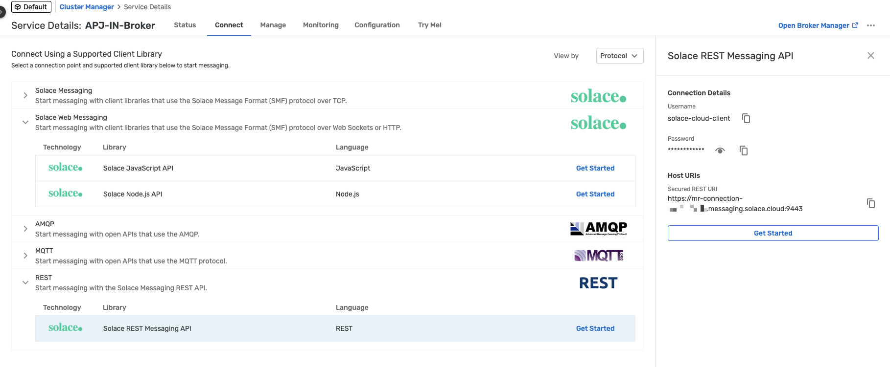

    > 🚨 The connection details (username and password) available in the **Connect** tab are the ones set by default when creating an event broker service. That doesn't mean that they will actually work (that is, you can update the password for the `solace-cloud-client` created with the event broker service). This is the case of the `solace-cloud-client` user in the `AMER-USEast-Broker`.

3. In the `AMER-USEast-Broker` event broker service, go to the **Manage** tab of the event broker service.

    In the **Manage** tab, you can access the event broker service manager. From here you can quickly access the clients, queues, access control and bridge of our event broker and also see the different management tools available.

    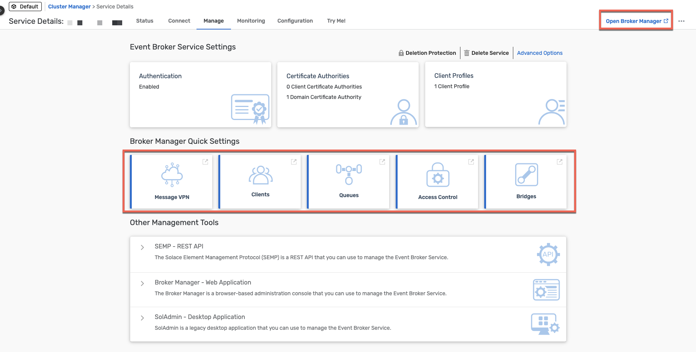

    > 💡 An idea ... once you start connecting to an event broker, remember to visit the **Clients** section of an event broker to see the clients connected and their details, for example, the username and protocol they are using to connect. 

4. In the `AMER-USEast-Broker` event broker service, go to the **Monitoring** tab of the event broker service.

    In the **Monitoring** tab, you will be able to get a summary of the messages exchanged via our event broker. 

    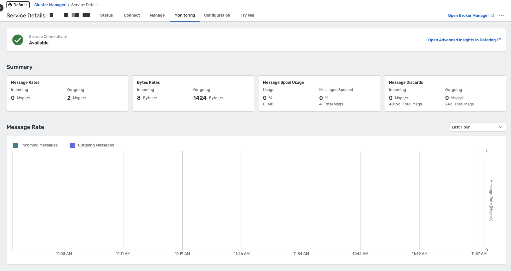

5. In the `AMER-USEast-Broker` event broker service, go to the **Configuration** tab of the event broker service.

    In the **Configuration** tab, you can see the service type (service class), the cloud provider and region where it is deployed, the upper limits of the event broker service: the maximum number of client connections, the maximum number of queues possible, the messaging storage and the maximum number of queue messages.

    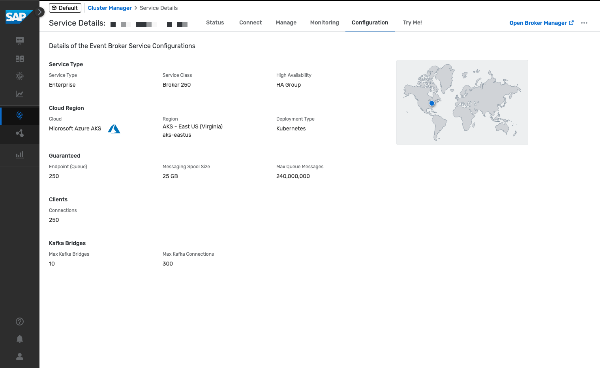

6. In the `AMER-USEast-Broker` event broker service, go to the **Try Me!** tab of the event broker service.

    And last but certainly not least ... the **Try Me** tab. From here, you will be able to access the Try Me! functionality that's available from within the event broker service. Through it, you can connect to the event broker, publish messages to it and also consume messages sent to topics. This is a great way to quickly test the event broker service and exchange simple messages.

    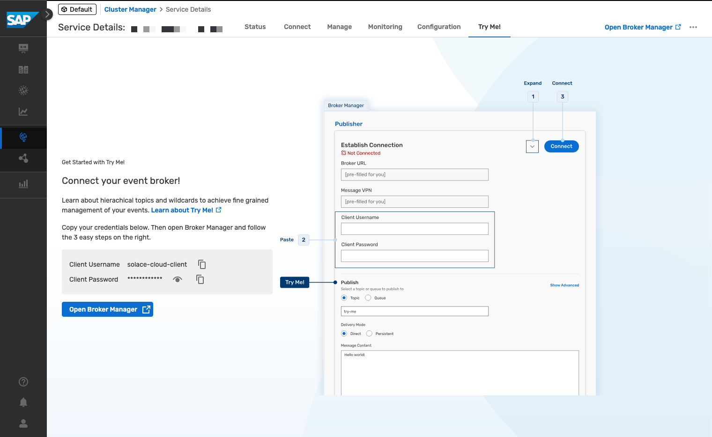

    
### Event Meshes

As you have learned in the previous section, an event mesh is composed of multiple event brokers that can span different regions and data centers. An event broker can only belong to a single mesh and the communication between event broker services in a mesh is powered by Dynamic Message Routing.event-broker-configuration

> **Dynamic Message Routing** is the underlying technology enabling message exchange between different event broker services (nodes) in an event mesh. DMR allows connected nodes to automatically determine how to forward event messages within the same site (horizontal scaling) or between sites (multi-site scaling) to exchange subscription information.

> What's great about DMR is that the event brokers dynamically discover how to route messages between each other, without the need for manual configuration. A client application doesn't need to know the exact event broker service to which it should publish or subscribe messages. The event mesh takes care of routing the messages to the correct destination.

> DMR is a key feature of the event mesh that allows you to scale your event mesh horizontally and across sites (multi-site).

In your case, you have don't have a mesh but you will be able to create one if you'd have more than one event broker service. Note that not all event broker services need to be part of a mesh and is a broker can exist as standalone. Also, you can have/manage multiple event meshes in an AEM instance. In the previous section there is an example of an SAP Integration Suite, advanced event mesh instance with multiple event broker services.

Creating an event mesh is quite simple, you just need to provide a name, select the event broker services that will be part of the mesh and specify the links between the event broker services.

### Insights

Insights provide you with a centralised place where you can monitor various aspects of the AEM instance:

- Resource usage

- Event mesh health

- Message flow

- High-Availability (HA) status

- Queue, topic endpoint, RDP, and bridge health

- Message spool utilization

- Capacity utilization

👉 Navigate to **Insights** and view the insights of our AEM instance.

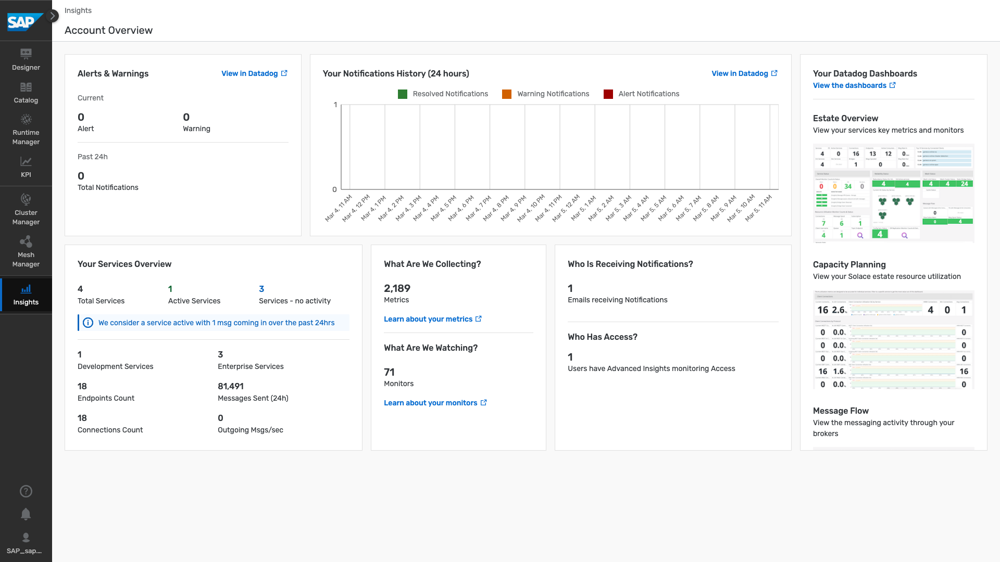

From here, you will also be able to access dashboards available in Datadog if [Insights advanced monitoring has been enabled](https://help.pubsub.em.services.cloud.sap/Cloud/Insights/Advanced-Monitoring/access-datadog.htm). You will not cover it in this tutorial but you can learn more about it in the [documentation](https://help.pubsub.em.services.cloud.sap/Cloud/Insights/Advanced-Monitoring/using-dashboards.htm). One thing to highlight here is that if you already use Datadog, it will be possible to [forward the Insights data](https://help.pubsub.em.services.cloud.sap/Cloud/Insights/insights_data_forwarding.htm) to your own Datadog account.

> 💡 An idea ... once you start exchanging messages in AEM, remember to visit the Insights section so that you can see how the number of messages

### Further study

In this tutorial, you explored the AEM instance that you created. You navigated through the different sections of the start page, the Cluster Manager, the Event Broker services, the Mesh Manager and the Insights section. You also create an event broker service.

To expand your learning, you might want to check out the links below and think about the open questions included in this section.

- Create Event Broker services - [link](https://help.pubsub.em.services.cloud.sap/Cloud/create-service.htm).
- Choosing the Right Service Class for Your Event Broker Service - [link](https://help.pubsub.em.services.cloud.sap/Cloud/ght_pick_service_type.htm).
- Creating an Event Mesh - [link](https://help.pubsub.em.services.cloud.sap/Cloud/Event-Mesh/ght_event_mesh.htm).
- DMR or a Message VPN Bridge? - [link](https://help.pubsub.em.services.cloud.sap/Features/DMR/DMR-Overview.htm#dmr-or-vpn-bridge).
- Insights Advanced Monitoring - [link](https://help.pubsub.em.services.cloud.sap/Cloud/Insights/Advanced-Monitoring/using-dashboards.htm).

>**Things to Ponder**
>
> 1. Which protocols can you use to connect to an event broker service in AEM?
> 2. Can you list some of the programming languages that there are SDKs available for, which can be used for Solace Messaging?
