# Set up SAP S/4HANA Cloud connectivity with SAP Integration Suite, advanced event mesh

<!-- description -->Learn how we can configure the connectivity between SAP S/4HANA Cloud and SAP Integration Suite, advanced event mesh.

## Prerequisites
- You have access to an SAP S/4HANA Cloud system and an SAP Integration Suite, advanced event mesh tenant
- You've completed the previous tutorial: [Set up SAP Integration Suite, advanced event mesh](../setup-aem/setup-aem.md).

## You will learn
- How to configure the connectivity between SAP S/4HANA Cloud and SAP Integration Suite, advanced event mesh

## Intro
Now that we are familiar with the SAP Integration Suite, advanced event mesh, we can proceed to configure the connectivity between SAP S/4HANA Cloud and AEM. For this, we will be interacting with both systems. In AEM we will import certificates and set up  a client username for our SAP S/4HANA Cloud system, which  needs to match the common name (CN) of the client certificate imported in AEM. In SAP S/4HANA Cloud, we will configure a couple of communication arrangements which will set up the communication channel used to send and receive events from AEM.

### Maintain Client Certificates in SAP S/4HANA Cloud

1. Go to the **Maintain Client Certificates** app in your SAP S/4HANA Cloud system. In the app, download the *Client Default* certificate. Select the **X.509 Certificate (.pem)** format and click the **Export** button.

    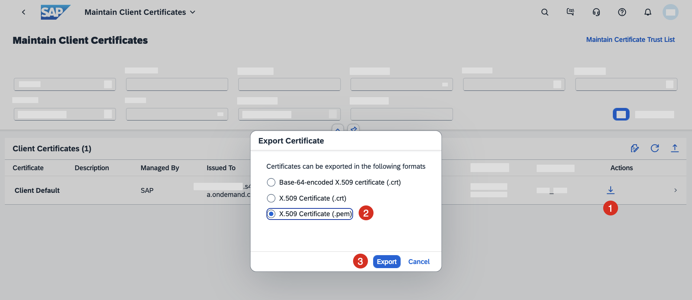

2. Download the SAP S/4HANA Cloud server root certificate from the website. The process will vary depending on the browser. In Firefox, you can do this by clicking on the lock icon in the address bar and clicking **Connection Secure** > **More Information**. In the **Security** tab, click on **View Certificate**. In the **Certificate Viewer**, go to the **DigiCert Global Root G2** tab and click on **Download** - **PEM (Cert)** in the **Miscellaneous** section.

    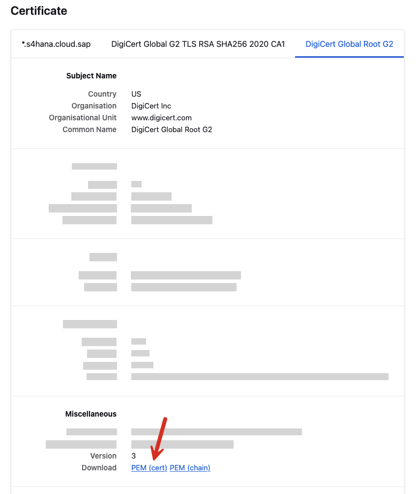

### Import default client certificate in AEM

In AEM, we will import the client certificate we downloaded from SAP S/4HANA Cloud. This will allow SAP S/4HANA Cloud to authenticate with AEM.

1. Check Client Certificate Authentication in the event broker service: Go to **Cluster Manager** and select the event broker service where we will configure the connection. Click on the **Manage** tab and click on the **Service Authentication** tile under **Authentication and Security**. In the **Client Authentication** section, click on the **Edit Client Authentication** button. Check the **Client Certifciate Authentication** checkbox if it has not been checked before. Click the **Save** button.

    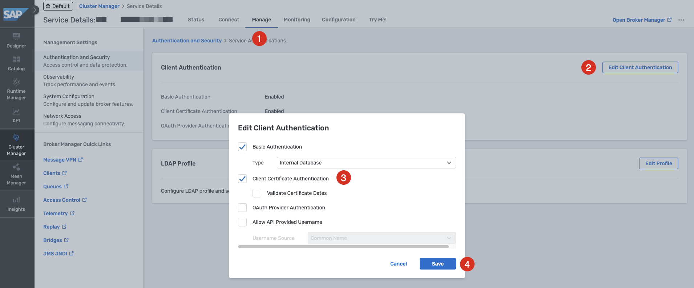

2. Import SAP S/4HANA Cloud website root certificate: In **Authentication and Security**, click on **Client Authorities**. Click on the Add Client Certificate Authority button. In the pop-up, enter a name and click the Import From File link to select the previously downloaded certificate. Click the **Save** button.

    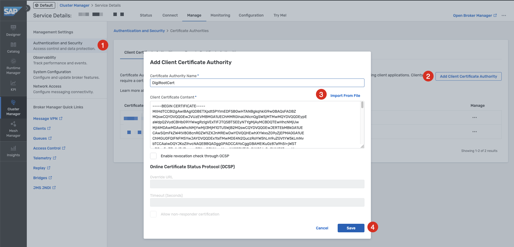

3. Repeat the process for the SAP S/4HANA Cloud default client certificate. This is the certificate downloaded from the **Maintain Client Certificates** app in SAP S/4HANA Cloud.

### Create SAP S/4HANA Cloud client username in AEM

We now need to create a client username in AEM which will be used by SAP S/4HANA Cloud to authenticate with AEM.

1. Create a new client username: In the broker manager of the event broker service that we are configuring, navigate to the **Access Control** section. Select the **Client Usernames** tab and click on the **+ Client Username** button. A pop-up will open. Enter a name for the client username, e.g. `my123456.s4hana.ondemand.com` and click the **Create button**. The client username needs to match the common name (CN) of the client certificate imported in AEM.

   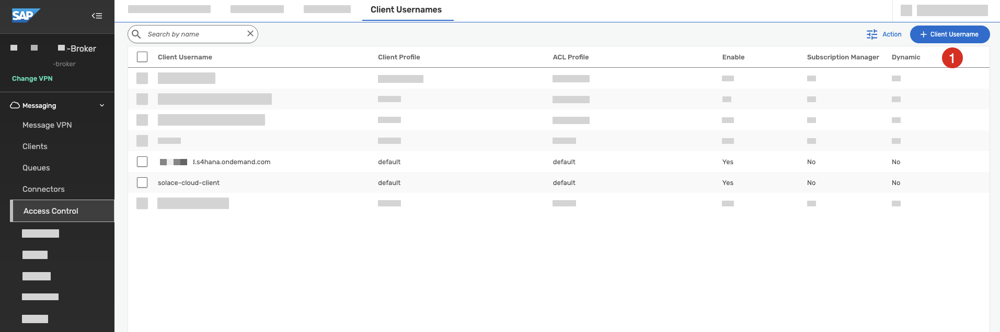

2. Enable the newly created client username: In the **Edit Client Username settings**, ensure to toggle the **Enable** switch and click the **Apply** button.

    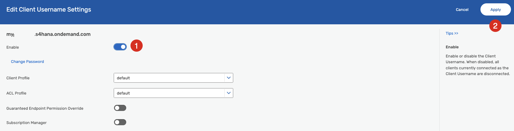

### Copy AMQP connection details from AEM event broker service

We need the AMQP host name and port when configuring the AEM integration scenario communication arrangement in SAP S/4HANA Cloud. Let's get this information from the AEM event broker service.

1. Go to the event broker service that we are configuring and navigate to the **Connect** tab. View the list by `Protocol` and expand the **AMQP** section. Select any AMQP item and copy the `AMQP Host` and `AMQP Port` values.

    

### Create Communication system

In SAP S/4HANA Cloud, we need to create a communication system which will be used to configure the AEM integration scenario communication arrangement in the next step.

1. Go to the **Communication Systems** app in your SAP S/4HANA Cloud system. Click on the **New** button and set a value for the **System ID/System Name**, e.g. `AEM-USEAST-BROKER`.
2. In the **Technical** > **General Data** section, enter the `AMQP Host` in the **Host Name** field and the `AMQP Port` in the **Port** field
3. In the **Users for Inbound Communication** section, click on the **+ (plus)** button. In the pop-up dialog select `User Name and Password` as **Authentication Method** and select an existing user or create a new user. 
4. In the Users for Outbound Communication section, click on the **+ (plus)** button. In the pop-up dialog select `SSL Client Certificate` as **Authentication Method** and select the Client Default certificate. This will need to be the same certificate that we downloaded previously from the **Maintain Client Certificates** app in SAP S/4HANA Cloud.
5. Finalise the creation of the Communication system by clicking the **Save** button.

    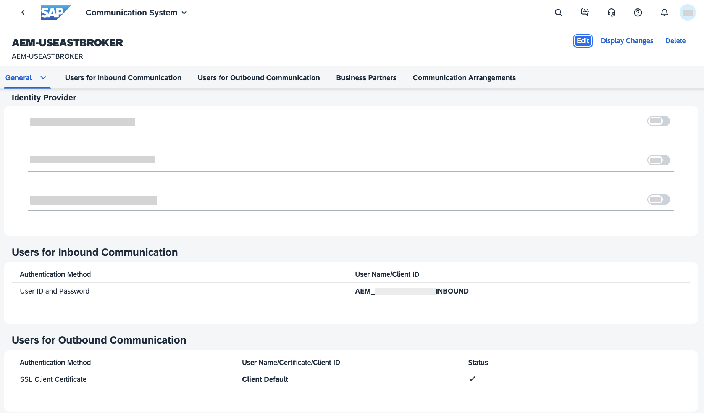

### Create Communication Arrangement - AEM integration scenario - SAP_COM_0492

We are now ready to create the first communication arrangement needed to establish the communication between SAP S/4HANA Cloud and AEM. 

1. Go to the **Communication Arrangements** app in the SAP S/4HANA Cloud system. Click on the **New** link and select the `SAP Integration Suite, Advanced Event Mesh integration (SAP_COM_0492)` communication scenario, set a name in the **Arrangement Name** field and then click the **Create** button.

    

2. In the **Common Data** section, select the Communication System that we created in the previous step.
3. In the **Additional Properties** section, set the values for the following properties:
    - **Channel**: For example `AEM-USEAST-BROKER`
    - **Topic Space**: For example `default/sap.s4hc/[SID]`. The topic space will be the prefix for the topics where SAP S/4HANA Cloud will publish messages.
4. As we selected the **Communication System** in item 2, the **Inbound and Outbound Communication** users will be automatically populated.
5. Scroll down to the **Outbound Services** section and we'll see the `AMQP Host` and `port` details that we specified when defining the communication system. The **Application Protocol** field states that this uses the HTTP Service but we can safely ignore this as the communication will be done over AMQP.
    

### Create AEM validation service instance in SAP BTP

We need to create an instance of the AEM validation service in the SAP BTP Cockpit. This instance will provide a service key which will be used to configure the `SAP_COM_0493` communication arrangement that we will create in the next step.

1. Log in to your SAP BTP account and navigate to `Services` > `Instances and Subscription`. Click the `Create` button.

    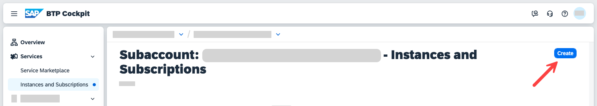

2. In the popup, select the service `SAP Integration Suite, advanced event mesh` and select the plan `aem-validation-service-plan` and `Other` as the runtime environment. 

    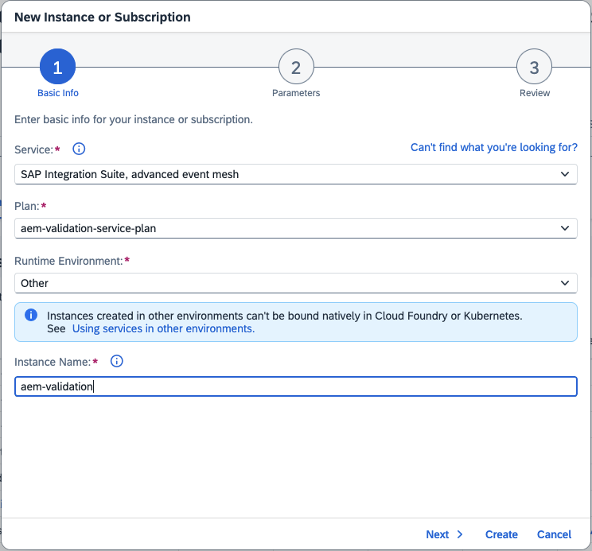

3. Once the instance is created, we can click on the instance name to access the AEM validation instance and create a service binding by clicking the **Create** button in the **Service Binding** section, enter a name and click the **Create** button.

    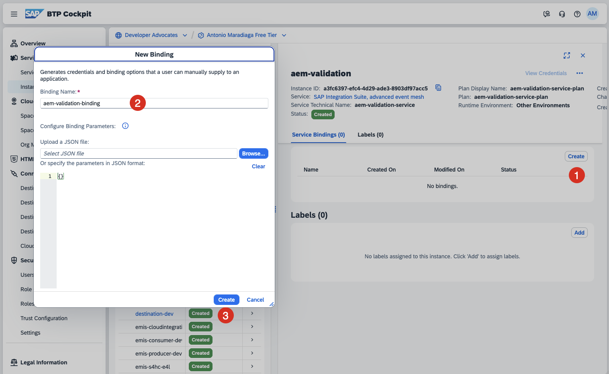

4. Once the service binding is created, we can click on the service binding name to access the service key. Copy the service key details as we will need it to configure the `SAP_COM_0493` communication arrangement in the next step.

### Create Communication Arrangement  - AEM validation assessment - SAP_COM_0493

Now we are just missing to create the second communication arrangement. To create it, we will use the service key we copied in the previous step.

1. In the **Communication Arrangements** app, click on the **New** link and select the `SAP Integration Suite, Advanced Event Mesh validation assessment (SAP_COM_0493)` communication scenario
2. Set a name in the **Arrangement Name** field.
3. Paste the service key we copied in the previous step in the **Service Key** field.
4. Specify the **Channel** name, e.g. `AEM-USEAST-BROKER`, by clicking the Additional Properties link. This will open a new pop-up where we can enter the channel name. This is the same channel name we used in the previous communication arrangement (SAP_COM_0492).

    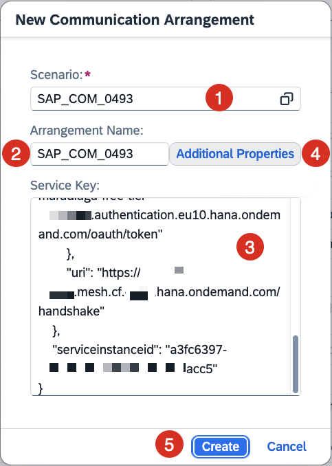

5. Finalise the creation by clicking the **Create** button.

With this final step, we have configured the connectivity between SAP S/4HANA Cloud and AEM. We can now start sending and receiving messages from SAP S/4HANA Cloud to AEM.

### (Optional) Check connection between SAP S/4HANA Cloud and AEM

To test the connectivity, we can send a test event from SAP S/4HANA Cloud to AEM. For this, we will leverage the functionality available in the **Enterprise Event Enablement - Event Monitor** app.

1. In SAP S/4HANA Cloud, go to the **Enterprise Event Enablement - Event Monitor** app. 
2. In the app, select the channel we specified in the steps above, e.g. `AEM-USEAST-BROKER` and click on the **Produce Test Event** button.

    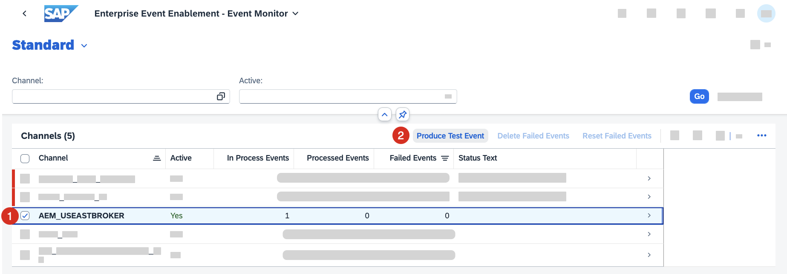

3. Now, navigate to the channel itself. In it, there will be an event available in the Outbound Events section and the status will be `Acknowledged`. This means that the event was successfully sent to AEM.

    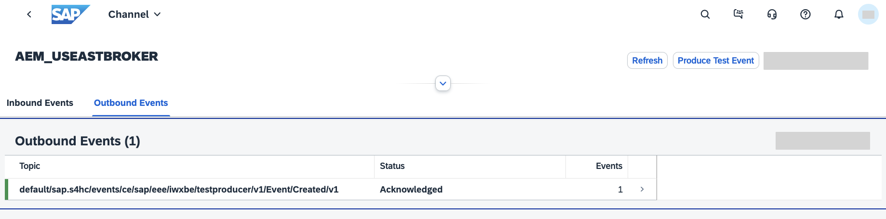

### Further study

You can check out the following resources to learn more about the SAP S/4HANA Cloud and SAP Integration Suite, advanced event mesh integration:

- Integration Architecture Guide - Event-driven architecture: https://help.sap.com/docs/sap-btp-guidance-framework/integration-architecture-guide/event-driven-architecture?locale=en-US
- SAP S/4HANA Cloud Integration with Advanced Mesh Service Plan: https://help.sap.com/docs/SAP_S4HANA_CLOUD/0f69f8fb28ac4bf48d2b57b9637e81fa/9b34c841dfba4f82af0825a2f3196ecf.html?locale=en-US
- Manage Client Certificate authorities in AEM: https://help.pubsub.em.services.cloud.sap/Cloud/server_certs.htm
- Configuring an Event Broker Service to use Client Certificate Authentication: https://help.pubsub.em.services.cloud.sap/Cloud/ght_client_certs.htm
- Create an instance of the AEM validation service: https://help.sap.com/docs/sap-integration-suite/advanced-event-mesh/validation-of-vmr-provisioning